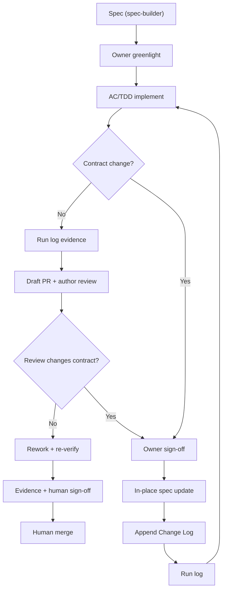

# Spec-Driven Development

Post-greenlight lifecycle around an approved deliverable SPEC through human-reviewed merge. Does not replace `spec-builder`, `qa-testing`, `pr-builder`, `pr-review`, `gh-stack`, or implementers — coordinates them. Pre-greenlight drafting → `spec-builder`.

## Core model

SPEC body = current executable contract. Accepted Owner/QA/UAT/PR/bug findings that change contract → update affected sections **in place**. `Implementation And Review Change Log` = audit trail (source, sections, rationale, summary, verification impact) — not a competing requirements list. Run log / execution record = append-only attempts, phases, evidence, failures, QA, handoffs, recoveries. MUST NOT rewrite prior run-log entries unless user asks.

## Lifecycle



## AC/TDD loop

1. Read greenlit SPEC + required refs 2. Verify applicable standards 3. Resolve OQs 4. TDD entry / strongest narrow check 5. Small slices vs ACs 6. Named tests/manual checks 7. Run-log progress/evidence/deviations 8. Repeat until each AC has evidence.

Adaptive detail within scope/behavior/ACs/tests/review shape/invariants → log deviation, continue. Contract change → protocol below.

## Lead / subagents / tracking

Lead owns: scope control, delegation boundaries, file-conflict serialization, integration, evidence↔AC mapping, run-log/tracker, PR-ready output. Subagents: bounded phases/tasks/tests/QA/docs only when SPEC names boundaries; return files, commands, evidence, risks, OQs. Single worktree/stack lane; serialize overlapping file ownership. Prefer fresh-context agents for independent QA (read-only). Tracking: board/Jira/other per repo; else local `<DOCS_ROOT>/execution/` run log.

## Change protocol

When accepted feedback changes scope, public behavior, UX, API/schema/validation, bug-fix behavior, test strategy, sequence, review shape, branch contract, invariants, or ACs:

1. Stop affected slice 2. Identify sections 3. Owner sign-off 4. In-place SPEC update 5. Append Change Log entry 6. Run-log rework/re-verify 7. Re-run invalidated checks 8. Stacked: rebase/propagate upstack + no-drift checks

```markdown
### YYYY-MM-DD HH:MM TZ — Short Change Title
**Source.** …  **Changed Sections.** …  **Rationale.** …  **Summary.** …  **Verification Impact.** …
```

## What belongs where

| Surface | Content |
| --- | --- |
| SPEC body | Current contract |
| Change Log | Post-greenlight contract-change audit |
| Run log | Append-only execution history |
| PR / review | Reviewer summary, evidence, risks; link SPEC |
| Commits | Implementation history — not sole contract explanation |

**Change Log MUST NOT hold:** ordinary progress, test output without contract change, pure refactors, unrelated formatting, PR-body-only edits, failed attempts, in-scope adaptive detail → run log / PR / commits.

## New SPEC instead when

New deliverable boundary; separate review artifact; branch/PR topology beyond approved shape; new feature context; original misleading even after in-place+log; primarily docs/process/tooling/standards outside product capability.

## Review / sign-off

Before human review: every AC evidenced; SPEC matches behavior; each contract change logged; run log current; QA resolved or known-risk; draft PR links SPEC + summarizes material contract changes. Humans retain scope, UX, PR approval, merge.

## Boundaries

`spec-builder` = initial authoring; this = post-greenlight lifecycle; `qa-testing` / `pr-builder` / `pr-review` / `gh-stack` as named.
