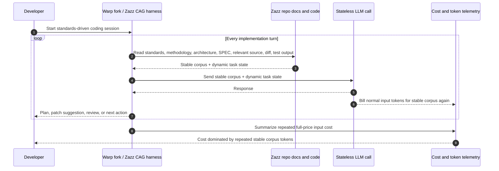
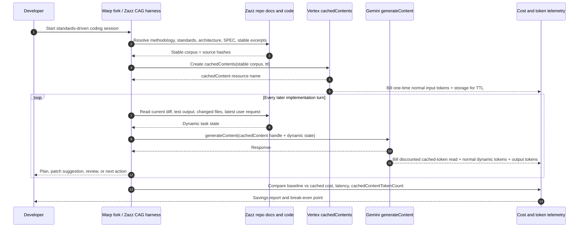
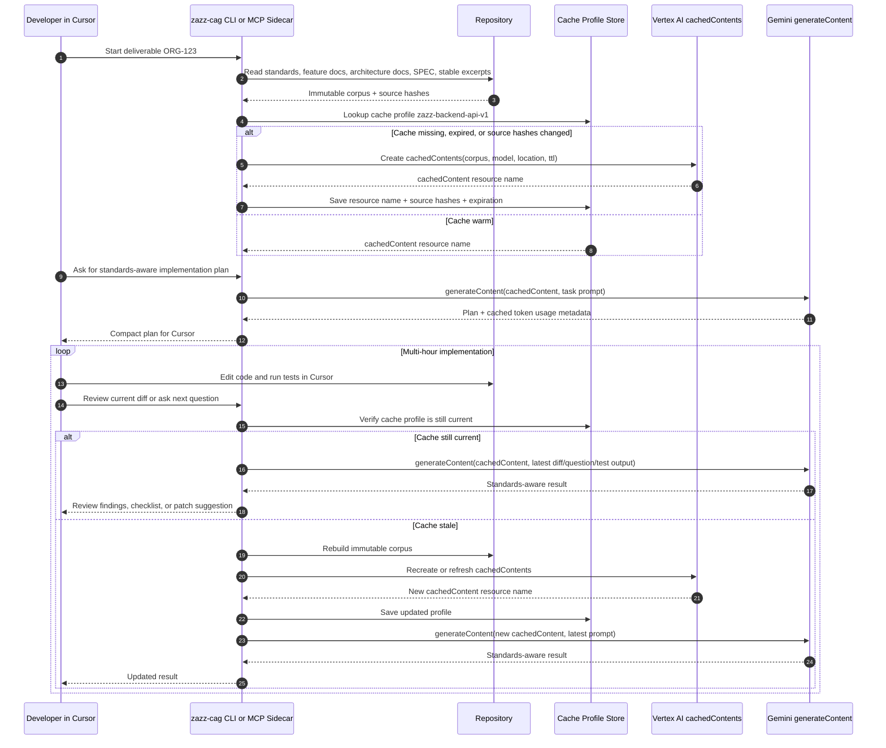

# Cache-Augmented Generation for Standards-Driven Agentic Development

Date: 2026-05-23  
Status: revised decision document  
Note: Extended research corpus removed 2026-08-22 for token compression; see Git history before that commit.

## Purpose

This document captures the practical outcome of the CAG research for standards-heavy agentic software development. Command-line examples that use the `zazz-*` prefix and paths under `.zazz/` describe a researched external harness experiment, not a requirement of the Agentic Engineering Framework repository layout; the body below keeps those identifiers where they document the experiment verbatim.

The problem is not only that agents need access to standards, feature documents, architecture documents, deliverable specs, and selected source files. The real cost problem is that those stable documents are repeatedly read, selected, and sent to the LLM across long implementation sessions.

The target state is a workflow where immutable or slow-changing project context is cached once, then referenced during later agent turns without resending the full corpus every time.

## Decision Summary

The most important conclusion is:

**Vertex AI Gemini `cachedContents` is the cleanest documented hosted named-cache option found in this research.**

Cursor, Codex, Z.AI/GLM, OpenAI direct, Anthropic, Qwen, DeepSeek, and local runtimes all have useful cache-related capabilities, but they do not all solve the same problem.

For the specific requirement of named cache profiles for standards/specs, with create/list/get/update/delete lifecycle control, Gemini through Vertex AI is the best documented hosted path.

## What We Can Conclude

### Cursor

Cursor does not document a user-facing way to create, tag, pin, inspect, invalidate, or explicitly reuse named model caches for markdown, JSON, specifications, standards, or selected source files.

Cursor provides strong context selection:

- `AGENTS.md` and nested `AGENTS.md`
- `.cursor/rules/`
- `@file`, `@folder`, `@Docs`
- codebase indexing and semantic search
- subagents
- MCP tools and resources

These are useful, but they are not documented as model cache controls. Mentioning a markdown or JSON file in `AGENTS.md` should not be treated as creating a cache.

### Codex / OpenAI

OpenAI's API supports provider-side prompt caching, `prompt_cache_key`, `prompt_cache_retention`, and cached-token telemetry.

Codex documentation describes cache-friendly prompt structure and stable prompt prefixes, but the reviewed Codex CLI/app documentation does not expose a user-facing named-cache workflow equivalent to Vertex `cachedContents`. Codex also documents web-search caching, but that is search-result caching, not model prompt-cache or standards/spec CAG control.

OpenAI prompt caching can reduce cost and latency when repeated prefixes match, but it is not a named document cache lifecycle.

### Z.AI / GLM

Z.AI direct is the best hosted GLM path found. It provides GLM-family models, automatic context caching, cached-token telemetry, and cached-input pricing.

It does not document a named cache API for creating, listing, pinning, invalidating, or referencing standards/spec caches by ID. It is useful for stable-prefix savings, not for a first-class cache-profile control plane.

### Anthropic Claude

Anthropic provides strong explicit prompt caching through `cache_control`, TTLs, and cache read/write telemetry. This is useful when calling Anthropic directly.

It is not the same as a named standards/spec cache resource. It is a prompt-block caching mechanism.

### Gemini / Vertex

Vertex AI Gemini provides explicit `cachedContents` resources. These can be created, referenced in later `generateContent` calls, inspected for metadata, updated for TTL/expiration, and deleted.

That is the closest hosted API to the desired Zazz cache profile concept.

## Capability Comparison

| Option | Named cache lifecycle | User control | Best use | Main limitation |
| --- | --- | --- | --- | --- |
| Cursor Agent | No documented named model cache | Context selection only | Required employee IDE workflow | Cannot pass Vertex `cachedContent` handles to Cursor's model call |
| Codex app/CLI | No documented named cache workflow | Stable prompt structure, model choice, workflow controls | OpenAI-native coding agent | No documented standards/spec cache profile control |
| OpenAI API | No named document cache | `prompt_cache_key`, retention hints, telemetry | Custom harness with GPT quality | Still sends full prompt content; cache key is routing/locality, not a cache object |
| Anthropic API | No named document cache | Explicit cache blocks and TTLs | Direct Claude harness | Cache breakpoints, not reusable document resources |
| Z.AI direct GLM | No named cache lifecycle documented | Automatic caching and telemetry | Hosted GLM experiments | No create/list/delete cache API; Singapore latency may matter |
| Vertex Gemini | Yes, through `cachedContents` | Create/list/get/update/delete, TTL, metadata | Hosted standards/spec cache profiles | Requires direct Vertex/Gemini API usage |
| Local vLLM/SGLang | Runtime-level prefix/KV cache | High, if you own serving | True self-hosted CAG experiments | Hardware and operations cost |

## Is Vertex Through an API Key?

For the recommended enterprise path, treat this as a **Vertex AI integration**, not just a generic API-key integration.

A simple Gemini API key may be enough for small prototypes depending on which Gemini API surface and caching features are used. However, the stronger path for company software development is Vertex AI because it gives better control over:

- Google Cloud project and billing
- model location/region
- IAM and service accounts
- auditability
- VPC Service Controls
- enterprise data residency controls
- cache resource lifecycle in a selected location

Practically, a production Zazz CAG gateway would usually authenticate to Vertex with Google Cloud credentials, such as Application Default Credentials or a service account, rather than relying only on a personal API key.

## Can Cursor Use Vertex cachedContents Directly?

Not through documented Cursor Agent controls.

The key issue is who owns the model request. Vertex `cachedContents` works only when the caller sends a `generateContent` request that includes:

```json
{
  "cachedContent": "projects/PROJECT_NUMBER/locations/LOCATION/cachedContents/CACHE_ID",
  "contents": [
    {
      "role": "user",
      "parts": [
        { "text": "Current task-specific prompt..." }
      ]
    }
  ]
}
```

Cursor owns its own model invocation. Current Cursor documentation does not show a way for the user to inject a Vertex `cachedContent` resource name into Cursor's Gemini model call.

Therefore:

- Cursor-only workflow can improve context selection, but cannot guarantee Vertex cache reuse.
- A sidecar service can use Vertex cached contents for planning, review, or standards-aware analysis, then return compact outputs to Cursor.
- A full custom harness can own the entire agent loop and use Vertex cached contents on every model turn.

## Recommended Architecture

The practical architecture is a three-layer approach.

### Layer 1: Cursor Context Hygiene

Use this immediately, because Cursor is the required IDE workflow.

- Keep root `AGENTS.md` short and stable.
- Use `.cursor/rules/` and nested `AGENTS.md` for scoped guidance.
- Keep standards in separate docs rather than pasting them into global instructions.
- Add `Required Context` and `Applicable Standards` sections to specs.
- Generate a deterministic context pack for a deliverable.

This reduces accidental rereading and improves prompt stability. It does not create true CAG.

### Layer 2: Vertex CAG Sidecar

Use this when the task needs standards-aware reasoning but Cursor remains the editing environment.

The sidecar owns Vertex calls. Cursor does not become the cache runtime. Instead, Cursor asks the sidecar for targeted outputs.

Example commands:

```text
zazz-cag cache warm deliverable-ORG-123
zazz-cag plan deliverable-ORG-123 --question "What files should change?"
zazz-cag review deliverable-ORG-123 --diff
zazz-cag explain deliverable-ORG-123 --file src/example.ts
```

The sidecar sends the stable standards/spec corpus to Vertex once, stores the returned `cachedContents` resource name, and then reuses that resource for later planning/review calls.

Cursor receives compact results such as:

- implementation plan
- affected files
- standards checklist
- code review findings
- patch suggestions
- test plan

This lets expensive standards/spec reasoning happen through Vertex caching, while Cursor still handles editing and local verification.

### Layer 3: Full Custom Agent Harness

Use this only if the goal is to reduce model-input cost across every implementation turn.

A full harness must own:

- context profile resolution
- Vertex cache creation and TTL refresh
- model prompts and `generateContent` calls
- conversation summarization
- file edits
- terminal commands and test runs
- telemetry for cached tokens, cache misses, latency, and cost

This is the only way to guarantee that every agent turn references Vertex `cachedContents` instead of resending the stable corpus.

### Layer 4: Warp Terminal Feature or Fork

Use this if the team wants a terminal-native agent workflow instead of a separate Zazz-only harness.

Warp is a plausible place to implement this because the terminal harness can own the agent loop, terminal context, prompt assembly, and provider request. This does not require using Warp's bundled model path if the harness supports model/provider selection or bring-your-own API credentials. The key requirement is that the harness, not Cursor, makes the final Gemini/Vertex API call.

If Warp/Oz or a fork can be configured to call Vertex directly, then it could be pointed at Google Gemini on Vertex and used to test the CAG theory with real `cachedContents` resources. Unlike Cursor, a Warp feature or fork could be designed to pass Vertex `cachedContent` resource names directly into Gemini `generateContent` calls.

This is not off base. It is the most direct way to validate the theory without building a completely separate agent product from scratch:

1. Fork or extend the terminal harness.
2. Add a Vertex provider adapter.
3. Add a Zazz cache-profile registry.
4. Warm a `cachedContents` resource from standards/specs before the coding session.
5. Ensure every later model turn sends only dynamic coding-session state plus `cachedContent=<resource name>`.
6. Compare cached-token counts, latency, and cost against the same workflow without cached contents.

If the fork controls those calls, then the stable standards/spec corpus does not need to be resent as raw prompt text on every turn. The model still receives the cache reference, and dynamic state still has to be sent, but the expensive immutable corpus can be reused through Vertex.

The feature would need to add:

- a cache profile registry for standards/spec bundles
- deterministic context rendering from source files and file hashes
- Vertex authentication and project/location configuration
- `cachedContents` create/get/list/update/delete support
- cache warm/status/invalidate commands
- prompt assembly that sends stable corpus through `cachedContent` and dynamic terminal state as normal request content
- telemetry for cached token counts, cache misses, latency, and estimated cost savings

In this model, Warp is not merely attaching context. It becomes the cache-aware harness:

```text
Warp/Oz agent run
        ↓
resolve Zazz cache profile
        ↓
create or reuse Vertex cachedContents
        ↓
send terminal task turn with cachedContent=<resource name>
        ↓
apply/edit/review in the terminal workflow
```

This option is more ambitious than the Vertex sidecar, but less fragmented for day-to-day development if the team wants the terminal agent itself to benefit from cached standards/spec context on every turn.

## How Vertex cachedContents Would Work

The cache profile maps Zazz source documents to a Vertex cache resource.

```text
cache_profile_id = zazz-backend-api-v1
model = gemini-2.5-pro or gemini-2.5-flash
location = us-central1 or another approved Vertex location
source_files = standards + feature doc + architecture doc + deliverable SPEC + stable source excerpts
source_hashes = sha256 for each source file
cached_content = projects/PROJECT_NUMBER/locations/LOCATION/cachedContents/CACHE_ID
ttl = e.g. 4h, 8h, or 24h depending on allowed settings and economics
```

Creation flow:

1. Resolve the deliverable's required context.
2. Render a deterministic corpus in a stable order.
3. Create a Vertex `cachedContents` resource with the corpus, model, location, and TTL.
4. Store the returned resource name plus source hashes in a local lock file or small database.
5. On later turns, call `generateContent` with `cachedContent` and only the dynamic task prompt.
6. If a source hash changes or TTL expires, recreate or refresh the cache.

Example cache creation endpoint:

```text
POST https://LOCATION-aiplatform.googleapis.com/v1/projects/PROJECT_ID/locations/LOCATION/cachedContents
```

Example use endpoint:

```text
POST https://LOCATION-aiplatform.googleapis.com/v1/projects/PROJECT_ID/locations/LOCATION/publishers/google/models/MODEL_ID:generateContent
```

Example request body for later use:

```json
{
  "cachedContent": "projects/PROJECT_NUMBER/locations/LOCATION/cachedContents/CACHE_ID",
  "contents": [
    {
      "role": "user",
      "parts": [
        {
          "text": "Using the cached standards and SPEC, review the current diff and identify missing acceptance criteria coverage."
        }
      ]
    }
  ]
}
```

## Cost Model for Vertex Context Caching

Using explicit context caching changes the cost shape. It is not simply free reuse.

Based on the reviewed Google documentation:

- You pay standard input-token price to create the cache.
- Later requests that reference the explicit cache receive a discounted cached-input rate.
- For Gemini 2.5 or later models, Vertex documentation says explicit cached-token reads receive a 90% discount versus standard input tokens.
- For Gemini 2.0 models, Vertex documentation says explicit cached-token reads receive a 75% discount.
- Explicit caches also incur storage cost based on how long the cache is retained.
- Implicit caching is enabled by default and has no storage cost, but it does not provide the same named cache lifecycle or guaranteed explicit cache reference.
- Responses expose cached-token usage through `cachedContentTokenCount`, which should be captured in telemetry.

The practical economics are:

```text
total_cached_workflow_cost =
  one_time_cache_creation_input_tokens
  + explicit_cache_storage_cost_for_ttl
  + discounted_cached_token_reads_per_turn
  + normal_dynamic_input_tokens_per_turn
  + output_tokens_per_turn
```

This means caching is most attractive when:

- the standards/spec corpus is large
- the corpus is reused many times within the TTL
- the dynamic per-turn prompt is much smaller than the cached corpus
- the harness deletes or lets caches expire when work is finished
- telemetry confirms high `cachedContentTokenCount` on later turns

It may not save money when:

- the cache is used only once or twice
- the TTL is much longer than the coding session
- the cached corpus is small
- most cost comes from output tokens or large dynamic tool logs
- cache misses occur because the harness recreates profiles too often

For a Warp fork or Zazz sidecar experiment, the first benchmark should compare:

1. normal Gemini call with the full standards/spec corpus every turn
2. Vertex explicit cache creation plus repeated cached turns
3. the same cached turns with different TTLs, such as 1 hour, 4 hours, and 24 hours

The result should report total cost, time-to-first-token, total latency, `cachedContentTokenCount`, dynamic input tokens, output tokens, and storage cost.

## Experiment Thesis

The core premise is valid:

For standards-driven software development, it should be more efficient to cache a stable corpus of standards, guidelines, methodology documents, architecture documents, and deliverable specs once on the provider side than to resend the same corpus as ordinary stateless input on every agent turn.

The wording matters slightly. Vertex `cachedContents` should be treated as provider-side cached context/KV reuse, not as a general semantic index. It does not replace code search, embeddings, or retrieval. It helps when the same large context should be available to many later model calls.

The arbitrage to test is:

```text
without caching:
  every turn pays normal input-token cost for standards + specs + dynamic task state

with explicit Vertex caching:
  cache creation pays normal input-token cost once
  later turns pay discounted cached-token reads for standards/specs
  later turns still pay normal input-token cost for dynamic task state
  explicit cache storage cost accrues during the TTL
```

This is a good experiment when:

- the stable corpus is large enough to matter
- the same corpus is reused across many implementation turns
- the coding session lasts long enough to amortize cache creation
- the dynamic per-turn state is much smaller than the cached corpus
- the harness can prove cache hits through `cachedContentTokenCount`

It is not guaranteed to win when:

- the session is short
- the standards corpus is small
- the agent keeps sending huge dynamic logs, diffs, or summaries
- the cache TTL is too long relative to actual usage
- cache profiles are invalidated frequently by source changes

Why more providers do not expose this cleanly:

- Serving infrastructure is complex. Durable cache resources require lifecycle management, GPU/host memory or storage tiers, eviction policy, accounting, and region/security boundaries.
- Prompt caching is easier to expose as an automatic optimization than as user-managed cache resources.
- Named caches create product and safety questions: who owns the cache, how long it lives, how it is encrypted, how it is deleted, and how it interacts with privacy guarantees.
- Provider economics are mixed. Caching can reduce repeated input revenue, but it can also attract higher-volume workloads by lowering cost and latency.
- Stateless APIs are simpler for developers and providers. Explicit cache resources add another object lifecycle that clients must manage correctly.
- Many use cases do not reuse the same large corpus enough times for explicit caching to matter.

For Zazz, the hypothesis is still worth pursuing because standards-driven coding is unusually well suited to caching: the standards and methodology are stable, the same documents apply across many turns, and the workflow can measure whether cached-token discounts outweigh cache creation and storage costs.

## Token Efficiency Target

The token-efficiency target is the repeated standards/spec payload that appears in ordinary stateless agent calls.

In a standards-driven methodology, every serious coding turn may need the same durable context:

- software development methodology
- coding standards
- testing standards
- architecture documents
- feature documents
- deliverable SPEC
- selected stable source excerpts

Without provider-side caching, the harness has two poor choices:

1. resend that corpus on each turn and pay normal input-token cost repeatedly
2. omit or summarize the corpus and risk lower standards adherence

The desired improvement is to pay normal input-token cost once to create the provider-side cache, then pay discounted cached-token reads on later turns while sending only dynamic state at normal input-token cost.

The dynamic state still changes every turn and cannot be avoided:

- current user request
- current diff
- recent tool output
- test failures
- implementation notes
- short conversation/task summary

Traditional stateless sequence:



Proposed Vertex cached-context sequence:



This is the exact place the experiment seeks an advantage: avoid repeatedly paying full input-token cost for stable standards and methodology context during a multi-turn software development session.

## Sequence Diagram



## Implementation Proposal

### Phase 1: Document and Context Pack Discipline

Goal: reduce waste inside Cursor without changing the model harness.

Build:

```text
zazz context build <deliverable-id>
zazz context verify <deliverable-id>
```

Outputs:

```text
.zazz/context-packs/<deliverable-id>.context.md
.zazz/context-packs/<deliverable-id>.manifest.lock.json
```

Cursor usage:

```text
Use @.zazz/context-packs/<deliverable-id>.context.md as governing context.
Do not load unrelated standards unless this pack says they apply.
If the pack is stale, stop and ask to regenerate it.
```

This is not CAG. It is the foundation that makes later CAG deterministic.

### Phase 2: Vertex CAG Sidecar

Goal: use Vertex cachedContents while continuing to do daily development in Cursor.

Build a local or internal service with commands like:

```text
zazz-cag cache warm <profile>
zazz-cag cache status <profile>
zazz-cag cache invalidate <profile>
zazz-cag plan <deliverable-id>
zazz-cag review <deliverable-id> --diff
zazz-cag ask <deliverable-id> "question"
```

Responsibilities:

- Resolve context profiles from source files.
- Create and refresh Vertex `cachedContents`.
- Store cache handles and file hashes.
- Call Gemini directly for standards-heavy reasoning.
- Return compact, reviewable outputs to Cursor.
- Report cached token counts and cost estimates.

This is the recommended first real CAG implementation because it is useful without replacing Cursor.

### Phase 3: Custom Agent Harness

Goal: make every agent turn use Vertex cached contents.

This requires a separate agent harness because the harness must own the Gemini calls. It could be a CLI, Warp/Oz-style terminal agent, or internal service.

The harness would:

- read and edit files
- run tests
- maintain task state
- send each model turn to Vertex with `cachedContent`
- summarize dynamic state so the stable corpus remains cached
- emit patches or apply edits directly

Cursor could still be used as the IDE, but it would not be the model runtime for that cached loop.

### Phase 4: Warp Terminal Feature or Fork

Goal: make the terminal agent itself a Vertex cache-aware harness.

This is the option to explore if the desired long-term workflow is agentic software development from Warp/Oz rather than Cursor Agent. The implementation would add a Vertex cache adapter and Zazz cache-profile support directly to Warp or to a fork.

Candidate user experience:

```text
warp cache warm deliverable-ORG-123 --provider vertex --model gemini-2.5-pro
warp agent run --cache-profile deliverable-ORG-123 "Implement the next task"
warp cache status deliverable-ORG-123
warp cache invalidate deliverable-ORG-123
```

Required internals:

- Read Zazz deliverable metadata and applicable standards.
- Build a deterministic cache corpus.
- Create or reuse a Vertex `cachedContents` resource.
- Store the cache handle with file hashes and TTL.
- Include only dynamic task state, diffs, terminal output, and user prompts in later `generateContent` calls.
- Surface cache hit/cached-token telemetry in the terminal UI.

This is the cleanest route if the team wants a true agent harness that directly benefits from Vertex caching, but it requires product-level or fork-level work in Warp.

The important test is not whether the terminal is Warp specifically. The important test is whether the harness can:

- select Gemini/Vertex as the model provider
- authenticate with approved Google Cloud credentials
- create and reuse Vertex `cachedContents`
- send every later agent turn through `generateContent` with the cached content handle
- report cached token counts and compare them against a non-cached baseline

If those conditions are met, the harness can validate the token-efficiency theory with Vertex before the team decides whether the final product should be a Warp feature, a fork, or a separate Zazz agent runner.

This is a good parallel-agent exploration target. One agent can study Warp/Oz provider integration and prompt assembly. Another can prototype the Vertex `cachedContents` adapter and cache-profile registry. The convergence point is a coding-session loop where the harness proves, with telemetry, that stable standards/spec context is cached once and reused across later implementation turns.

## Recommended Next Step

Do not start by replacing Cursor.

Build the smallest useful Vertex sidecar:

1. Pick one deliverable with a large standards/spec corpus.
2. Create a deterministic context profile and lock file.
3. Create a Vertex `cachedContents` resource in an approved US region.
4. Add `zazz-cag plan`, `zazz-cag review`, and `zazz-cag ask` commands.
5. Compare three workflows:
   - Cursor alone
   - Cursor plus context pack
   - Cursor plus Vertex sidecar
   - Warp/Oz fork or feature with direct Vertex cachedContents support
6. Measure cached token count, latency, cost, and answer quality.

If the sidecar produces materially better cost or latency for standards-heavy reasoning, then consider a full custom harness. If it does not, keep the context-pack discipline and avoid the complexity.

## What This Means for Day-to-Day Development

If you are working in Cursor today, the practical workflow would look like this:

1. Create or select a deliverable SPEC.
2. Run `zazz context build <deliverable-id>`.
3. Run `zazz-cag cache warm <deliverable-id>` to create the Vertex cache.
4. Ask `zazz-cag plan` for a standards-aware implementation plan.
5. Bring that compact plan into Cursor.
6. Use Cursor Agent for edits and tests.
7. Periodically run `zazz-cag review --diff` to get standards-aware review without resending the full standards corpus to Cursor's model.
8. Use Cursor to apply or refine the review output.

This does not make Cursor itself use Vertex caching. It creates a cache-aware expert sidecar that helps Cursor do better work with less repeated standards/spec prompting.

If you want the actual implementation agent to avoid resending the corpus on every turn, then yes: you need a custom harness or agent runtime that calls Vertex directly.

## References

- Cursor rules and `AGENTS.md`: https://cursor.com/docs/rules
- Cursor semantic and agentic search: https://cursor.com/docs/agent/tools/search
- Cursor MCP: https://cursor.com/docs/mcp
- Cursor subagents: https://cursor.com/docs/subagents
- Cursor Agent overview: https://cursor.com/docs/agent/overview
- OpenAI prompt caching: https://developers.openai.com/api/docs/guides/prompt-caching
- OpenAI prompt caching cookbook: https://developers.openai.com/cookbook/examples/prompt_caching_201
- OpenAI Codex CLI reference: https://developers.openai.com/codex/cli/reference
- OpenAI Codex CLI features: https://developers.openai.com/codex/cli/features
- OpenAI Codex slash commands: https://developers.openai.com/codex/cli/slash-commands
- Anthropic prompt caching: https://docs.anthropic.com/en/docs/build-with-claude/prompt-caching
- Gemini API context caching: https://ai.google.dev/gemini-api/docs/caching
- Vertex AI context caching overview: https://cloud.google.com/vertex-ai/generative-ai/docs/context-cache/context-cache-overview
- Vertex AI create context cache sample: https://cloud.google.com/vertex-ai/generative-ai/docs/samples/generativeaionvertexai-gemini-create-context-cache
- Vertex AI use context cache: https://cloud.google.com/vertex-ai/generative-ai/docs/context-cache/context-cache-use
- Vertex AI update context cache: https://cloud.google.com/vertex-ai/generative-ai/docs/context-cache/context-cache-update
- Vertex AI generateContent reference: https://docs.cloud.google.com/vertex-ai/generative-ai/docs/model-reference/inference
- Vertex AI context cache metadata: https://cloud.google.com/vertex-ai/generative-ai/docs/context-cache/context-cache-getinfo
- Vertex AI data residency: https://cloud.google.com/vertex-ai/generative-ai/docs/learn/data-residency
- Z.AI context caching: https://docs.z.ai/guides/capabilities/cache
- Z.AI GLM-5.1: https://docs.z.ai/guides/llm/glm-5.1
- Z.AI pricing: https://docs.z.ai/guides/overview/pricing
- vLLM automatic prefix caching: https://docs.vllm.ai/en/latest/features/automatic_prefix_caching/
- SGLang prefix caching: https://sgl-project-sglang-93.mintlify.app/concepts/prefix-caching
