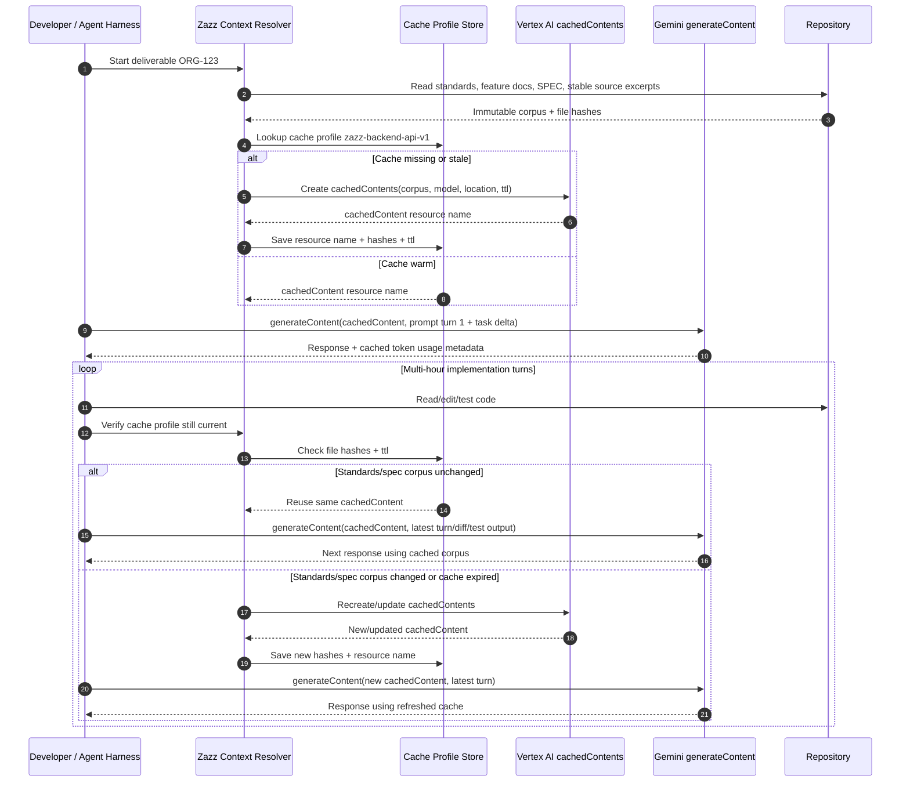

# Cache-Augmented Generation for Standards-Driven Agentic Development

Date: 2026-05-23

## Purpose

This document evaluates Cache-Augmented Generation (CAG) in the context of agentic software development, Zazz-style specifications, and standards-heavy repositories.

The practical question is:

How do we make sure agents consistently work from the right project standards, feature requirements, deliverable specifications, and review rules without forcing every session to manually paste or reload a large body of documentation?

## Latest Research Update: Cursor and Provider Cache Controls

Research date: 2026-05-23

### Factual Summary

Cursor does **not** document a user-facing way to create, tag, pin, inspect, invalidate, or explicitly reuse named caches for selected markdown files, JSON standards, specifications, or source files.

What Cursor documents today is context selection and orchestration:

- `AGENTS.md` and nested `AGENTS.md` files provide scoped agent instructions.
- `.cursor/rules/` provides project rules with metadata, `globs`, manual invocation, and `alwaysApply`.
- `@file`, `@folder`, `@Docs`, file reads, folder search, and semantic search let users and agents attach or discover relevant context.
- Codebase indexing stores semantic embeddings for search and retrieval; it is not documented as a reusable model KV cache.
- Subagents isolate context-heavy operations and return summarized findings to the parent agent.
- MCP tools and resources can bring external data or generated context bundles into Cursor, but Cursor still controls prompt assembly and model invocation.
- Cursor model and pricing docs expose provider/model token pricing and sometimes cache-read/cache-write billing columns, but do not expose provider-specific cache-control APIs in the Cursor UI or rules system.

Therefore, Cursor users should treat rules, `AGENTS.md`, explicit references, indexing, subagents, and MCP as **context selection mechanisms**, not as proof that a markdown or JSON file has been cached. Provider-managed prompt caching may happen underneath for some models, but Cursor does not document a user-controllable named cache lifecycle.

### Capability Matrix

| Capability | What it means | Cursor user control | Provider examples | Status for Zazz |
| --- | --- | --- | --- | --- |
| Context selection | Choose which instructions, docs, folders, files, and tool outputs enter the conversation. | Documented through `AGENTS.md`, nested `AGENTS.md`, `.cursor/rules`, `@file`, `@folder`, `@Docs`, tools, and MCP. | Agent harness behavior, not a model cache API. | Use heavily. This is the reliable Cursor-native layer. |
| Semantic indexing | Search code/docs by meaning using embeddings over workspace chunks. | Documented. Cursor indexes workspaces automatically, respects ignore files, and supports re-indexing. | Vector search/retrieval, not prompt cache reuse. | Use for discovery, but not as standards authority by itself. |
| Prompt caching | Reuse repeated prompt prefixes to reduce latency/cost. | Not directly controlled in Cursor docs. Cursor pricing/forum surfaces cache read/write behavior for some models, but no documented cache-control syntax for users. | OpenAI automatic prefix caching; Anthropic `cache_control`; Gemini implicit caching. | Structure stable prefixes, but do not depend on visible cache control inside Cursor. |
| True CAG / KV-cache reuse | Preload a bounded corpus, save model KV state, and reuse it for later calls. | Not documented in Cursor as a user-facing feature. | Some research systems and custom harnesses; Gemini explicit cached-content APIs are closest among mainstream providers. | Only possible outside normal Cursor unless Cursor later exposes cache profiles. |
| Provider-specific explicit cache APIs | Create or mark cacheable content using provider API parameters. | Not documented as exposed by Cursor. Cursor abstracts model orchestration. | Anthropic block/top-level `cache_control`; Gemini cached-content resources; OpenAI `prompt_cache_key` and retention hints. | Useful only in an external Zazz harness or provider-specific service. |

### Provider Findings

#### Cursor

Documented:

- Cursor rules are stored under `.cursor/rules`, can use `.md` or `.mdc`, and `.mdc` frontmatter supports `description`, `globs`, and `alwaysApply`.
- `AGENTS.md` is a plain Markdown alternative to `.cursor/rules`.
- Nested `AGENTS.md` files are supported and apply to their directory tree, combined with parent instructions.
- Semantic search uses code chunks, embeddings, and a vector database; indexing starts automatically when a workspace opens and syncs changed files.
- Explore, Bash, and Browser subagents exist specifically to keep context-heavy intermediate output out of the parent conversation.
- MCP supports tools, prompts, resources, roots, elicitation, and apps; MCP can bring external docs and data into the coding workflow.
- Composer 2.5 is Cursor's own agentic model, with a fast variant and documented token pricing. Cursor docs do not describe Composer 2.5 user-controllable prompt caching or CAG controls.
- Cursor model pricing includes provider-specific cache billing behavior for some models, but this is billing/model behavior, not a documented user cache API.

Inferred:

- Cursor likely benefits from provider-managed prompt caching when its prompt assembly produces stable prefixes and the selected provider/model supports caching.
- Cursor's visible cache read/write fields appear to be provider/model specific; forum discussion says Anthropic-style cache columns may not represent GPT/Gemini cache behavior in Auto mode.

Unknown:

- Cursor's exact internal prompt ordering, cache-key construction, and provider cache parameters are not documented.
- Cursor does not document whether users can supply OpenAI `prompt_cache_key`, Anthropic `cache_control`, or Gemini cached-content resource names through normal Agent usage.

#### OpenAI / Codex / GPT

Documented:

- OpenAI prompt caching is automatic for supported models when prompts are at least 1,024 tokens and share an identical prefix.
- Cache-hit usage is reported through `usage.prompt_tokens_details.cached_tokens`.
- OpenAI exposes `prompt_cache_key` to improve routing locality and `prompt_cache_retention` for retention policy where supported.
- Codex reads `AGENTS.md` at run/session start and rebuilds the instruction chain on each run; Codex docs explicitly say there is no manual cache to clear for `AGENTS.md`.

Inferred:

- Stable Zazz context packs at the start of prompts can improve OpenAI prompt-cache hit rates in external harnesses.

Unknown:

- Cursor does not document exposing OpenAI `prompt_cache_key` or `prompt_cache_retention` to Cursor users.

#### Anthropic Claude

Documented:

- Claude prompt caching supports top-level automatic caching and explicit cache breakpoints on content blocks.
- Default TTL is 5 minutes; a 1-hour TTL can be requested with `cache_control` TTL support.
- Cache usage is visible through `cache_creation_input_tokens` and `cache_read_input_tokens`.
- Cache invalidation depends on prompt structure and changes to cached prefixes, tools, messages, and related request fields.

Inferred:

- A Zazz external harness could mark stable standards/specification bundles with Anthropic `cache_control`.

Unknown:

- Cursor does not document a way for users to place Anthropic `cache_control` blocks in Cursor Agent prompts or rules.

#### Gemini / Vertex AI

Documented:

- Gemini supports implicit caching on newer models and explicit context caching through cached-content resources.
- Explicit caches can be created, referenced in later requests, inspected for metadata, updated for TTL/expiration, and deleted.
- Cached content itself cannot be retrieved/viewed; metadata such as name, model, usage metadata, and expiration can be retrieved.

Inferred:

- Gemini explicit cached-content APIs are the closest mainstream provider feature to named reusable context caches for standards/specs, but only through direct Gemini/Vertex API usage.

Unknown:

- Cursor does not document exposing Gemini cached-content resource creation or references through Agent.

### Answer to the Primary Question

No documented Cursor feature lets users directly create, tag, pin, inspect, invalidate, or reuse named caches for markdown/json standards, specifications, and selected source files.

Cursor users can directly control **what context is selected** through rules, `AGENTS.md`, explicit file/folder/docs references, indexing, subagents, and MCP. They cannot currently control the provider cache lifecycle from Cursor in the way a custom API harness can.

Do not assume that mentioning a markdown or JSON file in `AGENTS.md` creates a cache. The documented behavior is that `AGENTS.md` supplies instructions/context. It is not documented as a cache manifest, cache key, cache tag, or cache invalidation boundary.

### Recommendation for Zazz

Zazz should not rely only on Cursor-native rules/context selection, because standards-heavy deliverables need auditable context selection. It also should not start by building a full provider-specific caching harness, because Cursor does not expose those controls and external cache integration adds workflow complexity.

Recommended path:

1. Keep Cursor-native routing as the base layer: concise root `AGENTS.md`, nested `AGENTS.md`, `.cursor/rules`, `@file`, `@folder`, `@Docs`, and codebase indexing.
2. Build a lightweight Zazz context-pack utility that resolves a deliverable's applicable standards, specs, feature docs, and selected source paths into a stable, ordered context pack with file hashes.
3. Use the generated context pack inside Cursor via `@file` or explicit instructions. This improves selection, auditability, and prompt stability even without direct cache control.
4. Add an MCP context service only after the context-pack schema proves useful. MCP can centralize lookup/generation and expose context bundles as tools/resources, but it still does not guarantee provider cache reuse inside Cursor.
5. Integrate provider-specific caching outside Cursor only for high-volume or automation workloads where the savings justify a custom harness. Anthropic and Gemini offer explicit controls; OpenAI offers automatic caching plus routing/retention hints.

### Implementation Recommendations for Cursor and Terminal-First Harnesses

The cost problem has two layers:

1. **Context selection cost**: agents repeatedly read too many standards, specs, and source files.
2. **Model input cost**: the same stable context is repeatedly sent to the model on later turns or runs.

Cursor can help with the first layer today. It may benefit from provider-managed prompt caching for the second layer, but Cursor does not expose enough cache control to guarantee it. A terminal-first harness can solve both layers only if it owns the provider API call or delegates to a runtime that exposes provider-specific cache controls.

#### Option 1: Cursor-First, No Custom Model Harness

Use this if Cursor Agent is the required employee workflow and the goal is to reduce token waste without leaving Cursor.

Recommended design:

- Keep root `AGENTS.md` small and stable. It should route agents to indexes and standards, not contain all standards.
- Use nested `AGENTS.md` and `.cursor/rules/` for high-value, path-scoped rules.
- Add `Applicable Standards` and `Required Context` sections to every deliverable spec.
- Build a local `zazz context build <deliverable>` utility that outputs one stable context pack file.
- Reference that pack in Cursor with `@file`, for example `@.zazz/context-packs/<deliverable>.context.md`.
- Include a generated lock file with source file hashes so review can verify the pack is current.
- Keep the generated pack compact: summaries, selected excerpts, source links, test contract, and exact file paths.

This does not create true CAG, but it reduces tokens by preventing the agent from rediscovering and rereading broad documentation. It also makes the prompt prefix more stable, which can improve provider-managed prompt cache hit rates if Cursor/model routing supports them.

Practical first version:

```text
zazz context build <deliverable-id>
zazz context verify <deliverable-id>
```

Generated files:

```text
.zazz/context-packs/<deliverable-id>.context.md
.zazz/context-packs/<deliverable-id>.manifest.lock.json
```

Cursor prompt pattern:

```text
Use @.zazz/context-packs/<deliverable-id>.context.md as the governing context for this task.
Do not reread unrelated standards unless the context pack says they apply.
If the context pack is stale, stop and ask to regenerate it.
```

Expected benefit:

- Lower accidental context loading.
- Better standards adherence.
- More stable prompts for provider-managed caching.
- No dependency on unsupported Cursor cache controls.

Limit:

- Cursor may still resend the context pack or conversation history internally.
- Cursor does not expose cache hit/miss telemetry for all provider/model combinations in a normalized way.

#### Option 2: Cursor Plus MCP Context Service

Use this after the file-based context pack proves valuable and the team wants a smoother agent interface.

An MCP context service can expose tools and resources such as:

- `list_context_profiles`
- `get_context_profile`
- `build_context_pack`
- `verify_context_pack`
- `get_required_standards`
- `get_context_pack_resource`

Cursor can call the MCP server to discover and retrieve the right context bundle. Warp and other agent clients can reuse the same MCP server, which makes the investment portable.

The MCP service should cache deterministic outputs by file hash. That is **tool-output caching**, not model KV-cache reuse, but it still helps because the service can avoid recomputing packs and can return compact, stable bundles.

Expected benefit:

- Same context-selection logic across Cursor, Warp, Codex, and Claude-style clients.
- Centralized validation of applicable standards.
- Better audit trail for which standards governed a deliverable.

Limit:

- MCP cannot force Cursor to use provider-specific prompt caching.
- Returning a large MCP resource still consumes model context if Cursor includes it in the prompt.

#### Option 3: Terminal-First Harness Using Warp or Similar Tools

Warp documents an agent mode, terminal blocks as context, `@` context references, MCP support, and an `oz agent run` CLI that can attach MCP servers. This makes Warp a stronger baseline for a scripted, terminal-first workflow than a plain shell, especially if the goal is to standardize context-pack generation and agent execution.

However, Warp's documented context features are still context attachment and agent orchestration. They are not, by themselves, documented as true CAG or user-controlled provider cache APIs.

Recommended Warp-shaped design:

- Use Warp/Oz as the terminal workflow runner.
- Pass a Zazz MCP context service with `oz agent run --mcp`.
- Use agent profiles or run config files for stable system instructions.
- Use generated context packs as the stable prefix.
- Keep dynamic task state, command output, and terminal blocks after the stable context.
- For terminal output, prefer incremental reads or summarized command blocks rather than attaching whole terminal histories.

This can reduce token cost through better context hygiene. To get true prompt-cache or CAG savings, the harness must own the model request or use a runtime that exposes provider cache controls.

#### Option 4: External Provider-Specific CAG Harness

Use this only for high-volume, repeatable work where token savings justify a separate runtime.

Architecture:

- Cursor remains the primary IDE for editing, review, and human-in-the-loop work.
- Zazz context manifests define stable context profiles.
- A separate harness resolves the manifest into a stable ordered prompt prefix.
- The harness calls model providers directly and applies provider-specific caching:
  - OpenAI: stable prefix, `prompt_cache_key`, `prompt_cache_retention`, and cache usage telemetry.
  - Anthropic: explicit `cache_control` blocks around standards/spec bundles, with 5-minute or 1-hour TTL.
  - Gemini/Vertex: explicit cached-content resources for named reusable context.
- The harness writes outputs back to the repo as patches, plans, review notes, or context-pack updates.

This is the only option that can provide true user-controlled cache behavior with today's documented provider APIs.

Expected benefit:

- Real cache lifecycle control where providers support it.
- Cache hit/miss telemetry.
- Potentially large savings for repeated standards-heavy prompts.

Limit:

- Higher engineering and compliance burden.
- Workflow split between Cursor and an external harness.
- Provider-specific implementations must be maintained.

### Recommended Roadmap

Start with a Cursor-compatible context-pack utility, then add MCP, then add provider-specific caching only if measured usage justifies it.

Phase 1: Context Pack Files

- Add required context sections to specs.
- Build `zazz context build` and `zazz context verify`.
- Use generated packs in Cursor via `@file`.
- Track approximate token size before and after.

Phase 2: MCP Context Service

- Expose context profiles and packs as MCP resources/tools.
- Reuse the service from Cursor and Warp.
- Cache generated packs by source file hash.
- Add review checks that verify packs are current.

Phase 3: Terminal-First Agent Runs

- Pilot Warp/Oz or another terminal harness for repeatable tasks.
- Attach the Zazz MCP context service.
- Keep stable context first and dynamic terminal output last.
- Measure cost, latency, and quality against Cursor-only runs.

Phase 4: Provider-Specific Cache Adapter

- Add direct Anthropic/OpenAI/Gemini adapters only for repeatable high-volume workflows.
- Log cache reads, writes, and misses.
- Use provider-specific cache controls outside Cursor.
- Feed final patches and evidence back into the Cursor review workflow.

### Near-Term Recommendation

For an employee required to use Cursor Agent, the best near-term CAG-like solution is:

1. Do **not** try to force caching by bloating `AGENTS.md`.
2. Build compact, deterministic context packs per deliverable.
3. Use Cursor rules and nested `AGENTS.md` only for stable routing and path-scoped rules.
4. Add an MCP context service once the context-pack shape is stable.
5. Treat Warp or another terminal harness as a second-stage experiment for repeatable agent runs, not as a replacement for Cursor editing.
6. Reserve true provider cache APIs for an external harness, because Cursor does not currently document user-level cache controls.

### True CAG Deep Dive: What Actually Has to Be Cached

The important correction is this:

**Context packs and MCP do not implement true CAG.** They are useful context-selection and packaging layers. They solve "which documents should the agent use?" They do not solve "has the model already parsed these tokens into reusable inference state?"

True CAG requires caching model computation, usually the transformer key-value cache for a stable prompt prefix.

In the CAG paper's formulation:

```text
CKV = KV-Encode(D)
r = M(D + q) = M(q | CKV)
```

Where:

- `D` is the stable document corpus: standards, specs, architecture docs, selected source excerpts.
- `CKV` is the precomputed KV cache for `D`.
- `q` is the new user task or question.
- The model answers as if it had seen `D + q`, but the expensive prefill computation for `D` is reused.

That means a real CAG system must control at least one of these layers:

1. The inference server's KV cache, such as vLLM, SGLang, llama.cpp, or another local/self-hosted runtime.
2. A provider's explicit cache API, such as Anthropic prompt caching or Gemini cached-content resources.
3. A provider's automatic prefix cache parameters and telemetry, such as OpenAI prompt caching with stable prefixes and cache keys.

If the agent client cannot control any of those layers, it cannot guarantee true CAG.

#### Where the Cache Mechanism Actually Lives

The cache mechanism is usually **not in the model weights themselves**. It lives in the serving layer around the model:

- **Model architecture** determines whether efficient KV-cache reuse is practical and how large the cache is.
- **Inference server / provider runtime** owns the actual KV cache, prefix cache, disk cache, eviction policy, TTL, and cache lookup.
- **Harness / agent client** can only use true caching if the runtime exposes a control surface or automatic behavior.
- **Prompt builder** can make cache hits more likely by keeping stable content byte-identical and at the beginning of the request.

So the question is not "does GLM, Qwen, Claude, or GPT know how to cache?" The operational question is:

```text
Does the endpoint or inference server I am calling expose a cache mechanism that my harness can use or observe?
```

There are four practical categories:

1. **Explicit provider cache controls**
   - The harness can mark or create cacheable content.
   - Examples: Anthropic `cache_control`, Qwen explicit `cache_control`, Gemini cached-content resources.

2. **Automatic provider prefix/context caching**
   - The provider detects repeated prefixes and discounts cached tokens.
   - The harness cannot name/pin/invalidate caches, but can structure prompts and read telemetry.
   - Examples: OpenAI automatic prompt caching, DeepSeek disk context cache, Z.AI/GLM automatic context caching.

3. **Self-hosted inference cache control**
   - The harness or gateway controls the serving runtime.
   - Examples: vLLM automatic prefix caching, SGLang RadixAttention/RadixCache, llama.cpp prompt cache or slot save/restore.

4. **No exposed cache surface**
   - The harness can only send less context, summarize, or stabilize prefixes.
   - This is where context packs and MCP help, but they do not create true CAG.

This means a Warp fork could implement cache-aware behavior in the harness **only if** it owns the model request path or speaks to a cache-aware gateway. If Warp calls a provider through an opaque cloud service that does not expose cache controls or telemetry, the fork cannot force true CAG. If Warp calls Anthropic, Qwen, Gemini, DeepSeek, OpenAI, vLLM, SGLang, or llama.cpp directly, then the harness can implement provider/runtime-specific cache adapters.

#### Provider and Harness Cache Capability Matrix

The key distinction is provider API support versus agent-app exposure. A model can support caching through its API while Cursor, Codex, Claude Code, or Warp may abstract those controls away.

| Provider/model family | API cache capability | User-controllable through API? | Session concept? | If used through Cursor/agent app | Harness implementation needed? |
| --- | --- | --- | --- | --- | --- |
| OpenAI GPT-5.5 / GPT-5 family | Automatic prompt caching for repeated prefixes; `prompt_cache_key`; `prompt_cache_retention`; `cached_tokens` telemetry. | Partial. No `cache_control` blocks, but the caller can set cache key/retention and structure prefixes. | API calls are stateless unless using Responses state/conversation features; prompt cache is provider-side prefix reuse, not model memory. | Cursor may benefit internally, but Cursor does not document exposing `prompt_cache_key` or `prompt_cache_retention` to users. Codex structures prompts for caching; CLI exposure of all cache parameters is limited and client-version dependent. | Yes, if you want deterministic profile IDs, telemetry, and retention policy outside Cursor. |
| Anthropic Claude / Opus / Sonnet / Haiku | Explicit/top-level prompt caching with `cache_control`; 5-minute and 1-hour TTLs; cache read/write token telemetry. | Yes through Anthropic API. Cache breakpoints can be placed by the caller. | API is stateless unless caller resends history; prompt cache is backend reuse for matching prompt prefixes. | Claude Code manages prompt caching automatically and documents invalidation causes. Cursor using Claude may benefit, but does not document user placement of `cache_control`. | Yes, if not using Claude Code's built-in behavior or if you need explicit cache profile control. |
| Google Gemini / Vertex | Explicit cached-content resources with create/get/list/update/delete and TTL; implicit caching on newer models. | Yes through Gemini/Vertex APIs. This is closest to named cache objects among major hosted providers. | API remains request-based; cached-content resource is a referenced server-side context object. | Cursor/Warp only get this if their integration exposes cached-content creation/reference. | Yes, for named cache profile creation, TTL management, and invalidation. |
| Qwen / DashScope | Implicit cache, explicit `cache_control: {"type":"ephemeral"}`, and session cache via Responses API header. | Yes through Qwen APIs where supported. | Session cache is a provider-side cache mode, not general model memory; caller still manages conversation semantics. | Only usable if the app/harness passes Qwen-specific cache markers/headers. | Yes for provider-specific adapter and telemetry. |
| DeepSeek | Automatic disk context cache for repeated prefixes; hit/miss token telemetry. | Limited. Enabled by default; no documented named cache or explicit pin/invalidate. | API is stateless; disk cache is provider-managed repeated-prefix reuse. | Apps benefit only if they keep prefixes stable and expose telemetry. | Harness can optimize prefix layout and report hit/miss, but cannot force named cache lifecycle. |
| Z.AI / GLM-5.x | Automatic context caching for repeated/highly similar message content; cached-token telemetry. | Limited. No documented manual cache key or named cache lifecycle. | API is stateless; cache is provider-managed. | Apps benefit if prompt prefixes are stable and telemetry is surfaced. | Harness can structure prompts and track `cached_tokens`; cannot guarantee pin/invalidate. |
| Kimi / Moonshot / Groq-hosted Kimi | Provider-dependent. Kimi APIs are stateless; some platforms document automatic prompt caching for Kimi-family models; some third-party docs describe context-cache objects. | Varies by endpoint. Verify the exact Kimi/Moonshot/Groq API being used. | Usually stateless API; any cache is provider/runtime-side. | Depends entirely on the integration route. | Adapter should be endpoint-specific and telemetry-driven. |
| Composer 2.5 | Cursor-owned model with Cursor pricing. Separate public cache-control API is not documented. | Not documented for users. | Cursor session behavior is agent-app managed, not a user-controlled cache API. | Cursor owns prompt assembly and model routing. | Not unless Cursor exposes controls or you use a different serving path. |
| Local open-weight models via vLLM/SGLang/llama.cpp | Runtime-level KV/prefix cache reuse; possible save/restore/pinning depending on runtime. | Yes if you control the runtime. | The runtime can maintain slots, prefix trees, or saved cache files; session IDs can map to cache slots/profiles. | Cursor/Warp can only use this if configured to call the local runtime directly or through a gateway. | Yes. This is the most direct way to build true CAG. |

For GPT-5.5 specifically:

- The cache happens in OpenAI's serving layer, not inside Cursor and not as a user-visible Cursor object.
- The request still sends prompt content over the API. On a cache hit, OpenAI can reuse previously computed prefix state and bill/report cached input tokens.
- `prompt_cache_key` is a routing/cache-locality hint, not a named document cache.
- `prompt_cache_retention` can request a retention policy through the OpenAI API where supported.
- A Cursor user selecting GPT-5.5 does not currently get documented access to those parameters. Cursor may use provider caching internally, but the user cannot define `zazz-backend-standards-v1` as a named cache profile in Cursor.

For Codex specifically, based on the reviewed Codex CLI/app documentation:

- OpenAI's API supports `prompt_cache_key`, `prompt_cache_retention`, and cached-token telemetry.
- Codex documentation describes prompt structure as a cache-performance surface: stable system instructions, tool definitions, sandbox configuration, and environment context are kept in consistent order so prefix matches survive across turns.
- The current documented Codex CLI command/options pages do **not** show a user-facing `prompt_cache_key` or `prompt_cache_retention` setting.
- Codex documentation does expose web-search caching controls (`web_search = "cached"`, `"live"`, or `"disabled"`), but that is search-result caching, not model prompt-cache or CAG control.
- Codex slash commands include `/compact`, `/model`, `/fast`, and related workflow controls, but the reviewed docs do not show a slash command for named prompt caches, cache TTLs, or cache invalidation.

Conclusion for Codex:

- Codex + GPT-5.5/GPT-5.4 can benefit from OpenAI provider-side prompt caching when Codex sends stable prefixes.
- A Codex user does not have a documented named-cache workflow equivalent to Vertex `cachedContents`.
- If you need explicit standards/spec cache profiles with create/list/get/update/delete semantics, Codex is not the documented control plane; OpenAI API prompt caching is automatic/routing-hint based rather than named-cache-resource based.

For "session" semantics:

- Most chat/completions APIs are fundamentally stateless: each request must include the information the model should consider, unless the API offers a state/conversation abstraction.
- Prompt caching does not mean the model remembers your session. It means the provider can skip recomputing a repeated prefix when you resend it.
- True CAG for standards/specs is therefore usually "stable prefix reuse," not conversational memory.
- Session-like APIs can reduce client bookkeeping, but the provider still decides what is cached, retained, expired, and billable.

#### Providers and Runtimes With Explicit State, Conversation, or Cache Resources

These are the most relevant options for a session-oriented solution.

| System | Explicit conversation/session resource | Explicit cache resource | Cache/control notes | Fit for reducing repeated standards/spec cost |
| --- | --- | --- | --- | --- |
| OpenAI Responses + Conversations | Yes. Conversations are durable objects; `previous_response_id` can chain responses. | No named document cache, but prompt caching supports `prompt_cache_key` and retention. | Even with `previous_response_id`, prior input tokens are still billed as input tokens; prompt caching can reduce effective cost/latency for repeated prefixes. | Good if using OpenAI directly through a custom harness; limited if hidden behind Cursor. |
| Anthropic Managed Agents / Agent SDK | Yes. Managed Agents sessions and Agent SDK sessions maintain conversation history. | Prompt caching through `cache_control`, not a named document cache. | Sessions expose aggregate usage including cache read/write tokens. Messages API remains stateless unless using session/agent layers. | Strong for Claude-native agent workflows; less controllable when Claude is selected through Cursor. |
| Gemini / Vertex | Chat history exists in client/session abstractions, but the key cost feature is cached-content resources. | Yes. `cachedContents` resources support create/get/list/update/delete and TTL. | This is the closest hosted provider fit for named reusable standards/spec caches. | Strong candidate for external CAG gateway if Gemini quality is acceptable. |
| Mistral Agents / Conversations | Yes. Conversations store interaction history and can be started from agents or models. | Prompt caching uses `prompt_cache_key`, not named document cache resources. | Cached prompt tokens are reported in usage and billed at a discount. | Useful for server-side conversation management plus cache-key-based prefix reuse. |
| Qwen / DashScope | Session cache exists through Responses API header. | Explicit cache markers, not long-lived named resources in the same sense as Gemini. | Supports implicit, explicit, and session cache modes. | Strong candidate for a cache-aware harness. |
| DeepSeek | No general explicit session resource in the cache docs reviewed. | Automatic disk cache only. | Prefix hits/misses are reported; no explicit pin/invalidate. | Good if prompts are stable and telemetry is enough. |
| Z.AI / GLM hosted API | No explicit session/cache resource documented in reviewed cache docs. | Automatic context caching only. | Reports cached tokens; no manual cache key or named cache lifecycle documented. | Good for prefix-stable workflows, but not a named-cache solution. |
| Local vLLM | App supplies session/profile IDs; runtime provides prefix cache. | Runtime-level automatic prefix cache. | Reuses KV blocks for repeated prefixes. | Strong for self-hosted CAG if hardware is available. |
| Local SGLang | App supplies session/profile IDs; runtime provides RadixCache. | Runtime-level prefix/KV cache; HiCache variants add storage tiers. | RadixAttention/RadixCache reuses shared prefixes across requests. | Strong for self-hosted CAG and high-throughput agent serving. |
| Local llama.cpp | Slots and prompt cache behavior can act as sessions. | Prompt cache files and server slot save/restore. | Best for smaller/local models or CPU/GPU edge deployments. | Useful for prototypes and smaller models; less likely for frontier-level GLM-5.1 scale. |

For a true session-based solution, "session" needs two separate meanings:

1. **Conversation state**: the service remembers previous turns so the client does not manually resend history.
2. **Compute/cache state**: the service reuses KV/prefix computation so the model does not recompute stable context.

A provider can support one without the other. Conversation state improves ergonomics, but it does not automatically mean lower token cost. The cost reduction comes from prompt/context caching or runtime KV reuse.

#### GLM-5.1 as an Open-Weight Local Runtime Candidate

GLM-5.1 is a strong example because it can be used in two modes:

1. **Hosted Z.AI API**
   - Capable hosted model.
   - Automatic context caching is documented.
   - Cached token telemetry is available.
   - Manual named cache profiles are not documented.

2. **Self-hosted open-weight deployment**
   - GLM-5.1 is documented as open source under MIT license.
   - Weights are available through Hugging Face/ModelScope.
   - vLLM and SGLang provide deployment recipes for GLM-5.1/GLM-5.1-FP8.
   - Once served through vLLM/SGLang, cache behavior is governed by the runtime, not only the Z.AI hosted API.

This means a Warp-style terminal harness could point at a local OpenAI-compatible vLLM/SGLang endpoint and implement:

- context profile IDs
- deterministic prompt prefix rendering
- cache warmup requests
- file-hash invalidation
- runtime cache telemetry where available
- provider fallback when local capacity is unavailable

Would this improve throughput?

Yes, for the right workload. KV/prefix caching primarily improves the **prefill** phase: the expensive work of processing a long input prompt. It helps most when:

- many turns reuse the same long standards/spec prefix
- many users/tasks share the same repo or deliverable context
- outputs are not so long that decoding dominates total latency
- the runtime has enough memory to keep useful prefixes resident

It helps less when:

- every request has a different prefix
- dynamic terminal/tool output is inserted before stable context
- responses are extremely long, so decoding dominates
- the model is too large for available hardware
- cache entries are evicted before reuse

For GLM-5.1 specifically, local serving is plausible but not lightweight. The public recipes target large multi-GPU deployments such as 8x H200/H20-class hardware for FP8 serving. That makes GLM-5.1 more of an enterprise/shared inference service candidate than a laptop-local model. Smaller open models can use the same architecture on local developer machines, but they may not match GLM-5.1/GPT/Claude coding quality.

#### Cloud Hosting Options for Cache Experiments

If upfront local hardware is not affordable, cloud GPU rental can work for experiments, but the service choice matters.

##### AWS SageMaker / EC2

For CAG experimentation on AWS, SageMaker or raw EC2 GPU instances are a better fit:

- SageMaker can run custom containers such as vLLM or LMI-based inference images.
- EC2 gives the most direct control over vLLM, SGLang, llama.cpp, or custom gateways.
- You can enable runtime options such as vLLM automatic prefix caching and compare warm/cold runs.
- You can add your own cache profile registry, warmup route, and telemetry.

The tradeoff is cost and operational complexity. Large GLM-5.1-style serving wants multi-GPU H100/H200-class hardware. Public H100/H200 cloud pricing examples are commonly tens of dollars per hour for 8-GPU nodes on hyperscalers.

##### Google Cloud / Vertex AI

GCP has a similar option through Vertex AI custom prediction and Model Garden vLLM deployments.

GCP is especially interesting for this research because Vertex's vLLM integration documents:

- custom vLLM containers
- `--enable-prefix-caching`
- host-memory prefix caching in Vertex's optimized vLLM path
- multi-host GPU deployment for very large open models

This makes GCP/Vertex a strong managed-cloud candidate for cache experiments, especially if you want vLLM-style serving without building every operational layer yourself.

Cost-wise, GCP H100/H200-class serving is still expensive. It may be less cost-effective than specialized GPU clouds for small experiments, but it provides enterprise integration, quotas, IAM, storage, and managed endpoint workflows.

##### Specialized GPU Clouds

For pure experimentation, specialized GPU providers such as RunPod, Lambda, CoreWeave, Vast.ai, Thunder Compute, and similar marketplaces are often cheaper per GPU-hour than AWS/GCP/Azure.

They are attractive for:

- short-lived benchmark runs
- testing vLLM/SGLang prefix caching
- smaller open-model pilots
- validating whether CAG/prefix-cache savings are large enough to justify bigger investment

They are less attractive when the organization needs:

- enterprise IAM and audit integration
- strict network controls
- long-term production SLAs
- managed private connectivity
- corporate procurement approval

##### Cost-Effective Experiment Path

Do not start by hosting GLM-5.1 full scale.

A better sequence is:

1. Run a small or mid-sized open model through vLLM/SGLang on the cheapest available GPU instance.
2. Build a repeatable benchmark: cold prefix, warm prefix, changed-prefix miss, long-output decode-heavy case.
3. Measure TTFT, total latency, throughput, cache hit rate, and cost per task.
4. Repeat on a larger model only if prefix caching materially improves the workload.
5. Move to AWS/GCP only if the experiment needs enterprise controls or team-wide access.

For an individual budget, the most cost-effective route is usually:

- prototype on a smaller open model using RunPod/Lambda/Vast/Thunder-style GPUs
- use vLLM or SGLang prefix caching
- keep the benchmark and harness cloud-portable
- later decide whether AWS SageMaker, EC2, or GCP Vertex is worth the premium

For a company-backed enterprise pilot:

- use GCP Vertex custom vLLM or AWS SageMaker/EC2
- test with a smaller model first, then estimate GLM-5.1-class economics

The practical conclusion:

**Cloud-hosted open models can absolutely enable improved throughput from prefix/KV caching, but GLM-5.1-class serving is unlikely to be cost-effective for a solo experiment. Use a smaller model to prove the cache architecture, then scale only if the measured savings justify multi-GPU H100/H200 spend.**

#### Hosted API-Key Providers With Useful Cache Behavior

If the goal is to avoid renting GPUs and still benefit from provider-side cache behavior, the most useful path is an API-key provider that exposes either:

- cached-token telemetry
- explicit cache controls
- named cached-content resources
- provider sticky routing to improve cache hits

Relevant options:

| Provider / Router | Models relevant to this research | Cache capability | Control level | Why it matters |
| --- | --- | --- | --- | --- |
| Z.AI direct API | GLM-5.1, GLM-5, GLM-4.7, GLM-4.5 | Automatic context caching; `usage.prompt_tokens_details.cached_tokens`; discounted cached input pricing. | Low/manual control, good telemetry. | Best hosted GLM path. Uses GLM-family models directly through API key without running GPUs. |
| Google AI Studio / Vertex Gemini | Gemini 2.5+ and newer Gemini models | Implicit caching plus explicit `cachedContents` resources with TTL, metadata, list/get/delete/update. | High for Gemini. | Best hosted named-cache model among major providers. Good fit for standards/spec caches if Gemini quality is acceptable. |
| Qwen / DashScope | Qwen Plus, Qwen Coder, Qwen Max families | Implicit cache, explicit `cache_control`, and session cache header. | Medium/high. | Strong cache-control surface for hosted Chinese models. |
| DeepSeek direct API | DeepSeek V3/R1 families | Automatic disk context cache; `prompt_cache_hit_tokens` / `prompt_cache_miss_tokens`. | Low/manual control, strong telemetry. | Cheap and useful when prompts have stable prefixes. |
| OpenRouter | Many providers including Anthropic, DeepSeek, Gemini, Z.AI/GLM, Kimi depending on route | Supports prompt caching for supported upstreams; provider sticky routing; usage telemetry such as cached tokens/cache writes where available. | Medium, but model/route-dependent. | Convenient router for experimentation across providers, but verify each model route's cache behavior. |
| Groq | Kimi K2 and other supported fast models | Automatic prompt caching on supported models; cache hits in usage. | Low/manual control. | Good for fast hosted experiments with Kimi-style models if model quality fits. |
| Inworld / FastRouter / ARouter-style AI gateways | OpenAI, Anthropic, Gemini, DeepSeek, sometimes Groq/Moonshot/Qwen depending on gateway | Router-level support for implicit/explicit provider prompt caching and sticky routing. | Medium. | Useful if you want one API key and provider-agnostic cache handling, but must trust gateway behavior and pricing. |
| OpenAI direct API | GPT-5.5 / GPT-5 family | Automatic prompt caching, `prompt_cache_key`, `prompt_cache_retention`, `cached_tokens`. | Medium. | Strong for hosted frontier quality, but no named document cache. |
| Anthropic direct API | Claude Opus/Sonnet/Haiku | Explicit/top-level `cache_control`, TTLs, cache read/write telemetry. | High for prompt breakpoints. | Strong if Claude quality is needed and explicit prompt cache breakpoints are enough. |

For GLM specifically, the best API-key option appears to be **Z.AI direct** rather than a generic router:

- Z.AI documents automatic context caching for GLM-family models.
- GLM-5.1 pricing includes a separate cached-input rate.
- The API is available through OpenAI-compatible and Anthropic-compatible endpoints.
- The downside is lack of documented named cache create/pin/invalidate controls.
- The Z.AI privacy/DPA text reviewed says API customer data is generally processed in Singapore, not a US-only region. For US East users, this is mainly a latency consideration if Singapore processing is acceptable from a policy standpoint.

OpenRouter can be useful for trying GLM-5.1 and comparing providers, but it adds another abstraction layer. That means cache behavior depends on the selected route, router support, sticky routing, and what telemetry the route passes back.

For a true named-cache standards/spec solution without running hardware, **Gemini/Vertex cachedContents** remains the cleanest documented hosted API:

```text
create cachedContents resource from standards/spec bundle
        ↓
store returned cache resource name
        ↓
send task prompt with cachedContent=<cache resource name>
        ↓
update/delete cache when source hashes change
```

That is much closer to the desired "cache profile" abstraction than provider-managed automatic prefix caching. The tradeoff is model quality and whether Gemini works well enough for the coding-agent tasks.

##### Deeper Dive: Z.AI Direct API for GLM-5.1

Z.AI direct is the most straightforward hosted GLM path.

What it provides:

- GLM-5.1 and related GLM-family models through API key.
- OpenAI-compatible endpoint: `https://api.z.ai/api/paas/v4/chat/completions`.
- Anthropic-compatible endpoint is also documented for tool compatibility.
- Automatic context caching for repeated or highly similar context.
- Cached-token telemetry through `usage.prompt_tokens_details.cached_tokens`.
- Separate cached-input pricing for GLM-5.1.
- Strong coding/agentic positioning: Z.AI claims GLM-5.1 is aligned with Claude Opus 4.6 overall and scores strongly on SWE-Bench Pro and long-horizon agentic workflows.

What it does **not** appear to provide:

- A named cache API like `create cache`, `list cache`, `delete cache`, or `pin cache`.
- User-selected cache IDs for standards/spec bundles.
- User-controlled TTL or invalidation for prompt caches.
- US-only data residency in the public docs reviewed.

Best use:

- Direct hosted GLM experiments.
- Stable-prefix prompt caching where the harness keeps standards/specs byte-stable and first in the request.
- Coding-agent workflows where GLM-5.1 quality is the priority and Singapore processing plus trans-Pacific latency are acceptable.

Risk / open issue:

- If company policy requires US-only processing for source code, specifications, or proprietary docs, Z.AI direct may not fit unless the vendor provides a contractual/private deployment option with acceptable residency terms. If Singapore processing is acceptable, the main question becomes measured latency from the user's location.

##### Deeper Dive: Gemini / Vertex cachedContents

Gemini through Vertex AI has the best documented hosted cache-resource story.

What it provides:

- Implicit caching for repeated inputs on supported Gemini models.
- Explicit `cachedContents` resources.
- Create/list/get/update/delete operations.
- TTL or expiration control.
- Usage metadata showing cached token counts.
- Cache resources referenced by name in later `generateContent` requests.
- Regional Vertex endpoints and data residency controls.
- VPC Service Controls support for context caching.

Why it fits the desired CAG profile:

```text
cache_profile_id = zazz-backend-api-v1
source_files = standards/specs/source excerpts
        ↓
create Vertex cachedContents in selected US region
        ↓
store cachedContent resource name + file hashes
        ↓
send each task with cachedContent=<resource name>
        ↓
update/delete/recreate when file hashes change
```

That is the closest documented hosted API to a Zazz "context profile" or CAG cache without owning the inference hardware.

Data residency:

- Vertex AI lets requests target a selected location such as a US region or US multi-region.
- Google docs say data stored at rest in the selected location remains at rest in that location.
- ML processing occurs within the specific region or multi-region where the request is made, for supported models/regions.
- Cached contents are created in a specific project/location and can be listed or retrieved as metadata from that location.

Best use:

- A US-hosted standards/spec cache experiment.
- A CAG gateway where cache profiles map to Vertex cachedContents IDs.
- Workflows where Gemini coding quality is acceptable.

Tradeoffs:

- Gemini may or may not match GLM-5.1, Claude, or GPT for your coding tasks.
- Explicit caching has storage/TTL economics to model.
- Cached content still counts toward model token limits, even when discounted.

How it would work for immutable standards/specs:

1. The Zazz context resolver selects immutable or slow-changing documents:
   - methodology standards
   - coding standards
   - architecture documents
   - feature requirements
   - approved deliverable specification
   - selected source excerpts if they are stable enough to cache
2. The cache builder renders those inputs into a deterministic ordered corpus.
3. The gateway creates a Vertex `cachedContents` resource in the selected project and location.
4. The gateway stores:
   - Vertex cached content resource name
   - model ID
   - location
   - source file hashes
   - TTL or expiration
   - cache profile ID, such as `zazz-backend-api-v1`
5. Later agent turns call `generateContent` with the `cachedContent` resource name and only the dynamic task/context delta.
6. If a source file hash changes or TTL expires, the gateway recreates or updates the cache.

Example REST shapes:

```text
POST https://LOCATION-aiplatform.googleapis.com/v1/projects/PROJECT_ID/locations/LOCATION/cachedContents
```

The request includes the model, optional system instruction, contents to cache, and TTL. The response returns a resource name:

```text
projects/PROJECT_NUMBER/locations/LOCATION/cachedContents/CACHE_ID
```

Later requests reference that resource:

```text
POST https://LOCATION-aiplatform.googleapis.com/v1/projects/PROJECT_ID/locations/LOCATION/publishers/google/models/MODEL_ID:generateContent
```

With body shape:

```json
{
  "cachedContent": "projects/PROJECT_NUMBER/locations/LOCATION/cachedContents/CACHE_ID",
  "contents": [
    {
      "role": "user",
      "parts": [
        {
          "text": "Implement the next step of deliverable ORG-123. Current diff summary: ..."
        }
      ]
    }
  ]
}
```

For multi-turn agent work, the `contents` field still carries the dynamic conversation history or latest task state that the model should consider. The key savings is that the immutable standards/spec corpus is not resent as raw text each turn; it is referenced through `cachedContent`.

Sequence diagram:



Important limitations:

- The cached content is an opaque provider resource. You can get/list metadata and update TTL, but you should not treat the provider cache as your source of truth.
- The authoritative source remains the repository plus the cache profile lock file.
- Cached content still counts against the model's context/token limits; it is cheaper/faster when cached, not unlimited.
- Dynamic tool output, diffs, terminal logs, and current implementation state still need to be sent or summarized each turn.
- If the agent needs prior turn reasoning or decisions, those must be included in dynamic conversation state or captured in a separate durable work log.

##### US-Hosted Options for GLM-Like Workflows

For GLM-5.1 specifically, public docs reviewed do **not** show a clean US-only hosted API with named cache controls.

Options:

1. **Z.AI direct**
   - Best GLM-native hosted API.
   - Automatic cache and cached-input pricing.
   - Public docs indicate Singapore processing for API customer data, not US-only processing.
   - From Washington, DC, expect higher network round-trip latency than a US-East endpoint; prompt caching may still reduce time-to-first-token for large repeated prefixes.

2. **OpenRouter**
   - Convenient API-key access to `z-ai/glm-5.1`.
   - Supports prompt caching/sticky routing for supported upstreams.
   - Does not guarantee US-only processing for GLM routes in the docs reviewed.
   - Adds route/provider ambiguity.

3. **NVIDIA NIM / hosted catalogs**
   - GLM-5.1 appears in NVIDIA model references.
   - Public docs reviewed describe deployment geography broadly/global and do not establish US-only data residency or cache-profile APIs.
   - NIM model caching references often mean model artifact/engine caching, not prompt/KV CAG.

4. **Self-host GLM-5.1 in US cloud**
   - Most controllable US-residency path.
   - Use US-region GCP/AWS/specialized GPU cloud.
   - Serve with vLLM/SGLang and implement prefix/KV cache profiles.
   - Expensive at GLM-5.1 scale.

5. **Use Gemini/Vertex instead**
   - Best US-region hosted named-cache option.
   - Not GLM, but directly targets the cache-profile requirement.

Latency recommendation for Washington, DC:

- Benchmark Z.AI direct rather than rejecting it based on geography.
- Measure cold long-prefix call, warm long-prefix call, and short dynamic follow-up.
- Compare against Vertex in a US region using `cachedContents`.
- Focus on time-to-first-token and total task time, not just network ping, because cache hits may offset network distance for large prefixes.

Recommendation:

- If model quality/GLM behavior is the priority and Singapore processing is acceptable, test **Z.AI direct** first and measure latency from Washington, DC.
- If US residency and named cache lifecycle are the priority, test **Gemini/Vertex cachedContents** first.
- If GLM quality and US residency are both required, the realistic path is a **US-hosted vLLM/SGLang deployment of GLM-5.1** or a smaller GLM/Qwen/DeepSeek-class model on US GPUs.
- If cost is the primary constraint, start with **Z.AI direct** or **Vertex Gemini**, not self-hosted GLM-5.1.

#### Examples: Hosted and Chinese Model APIs

The Chinese/open model ecosystem is especially relevant because several providers document context caching.

##### Z.AI / GLM

Z.AI documents automatic context caching for GLM-family models, including GLM-5/GLM-5.1 style usage. The cache is implicit: repeated or highly similar message content is detected automatically, cached token counts are reported in `usage.prompt_tokens_details.cached_tokens`, and no manual cache key is documented.

Implication for a Warp-style harness:

- Put stable standards/specs at the front of the request.
- Keep the rendered prefix identical across calls.
- Track `cached_tokens`.
- Do not expect named cache create/pin/invalidate controls unless the provider adds them.

##### Qwen / DashScope / Qwen Cloud

Qwen Cloud documents three cache modes:

- implicit cache, enabled automatically
- explicit cache with `cache_control: {"type": "ephemeral"}` markers
- session cache through the Responses API with `x-dashscope-session-cache: enable`

This is a strong fit for a cache-aware terminal harness because the harness can choose explicit cache markers for stable context profiles, or use session cache for multi-turn agent runs.

##### DeepSeek

DeepSeek documents context caching on disk, enabled by default. It automatically caches repeated prompt prefixes and reports `prompt_cache_hit_tokens` and `prompt_cache_miss_tokens`.

Implication:

- The harness cannot explicitly create or pin a named DeepSeek cache.
- It can structure prompts for prefix reuse and measure hit/miss telemetry.
- DeepSeek's model/runtime architecture makes disk KV caching cheap enough for aggressive automatic caching, but it remains provider-managed.

##### Open-Weight Models Served Locally

For open models such as GLM, Qwen, DeepSeek, Llama, or Mistral served locally, the model family is less important than the serving runtime:

- vLLM can reuse repeated prompt prefixes through Automatic Prefix Caching.
- SGLang uses RadixAttention/RadixCache to reuse KV states for shared prefixes.
- llama.cpp can save prompt cache files or restore server KV slots.

This is the closest path to literal CAG because the Warp fork or local gateway can own cache warmup, cache IDs, invalidation, and persistence.

#### Harness vs Inference Runtime Responsibilities

A cache-aware Warp feature should split responsibilities like this:

| Responsibility | Harness / Warp fork | Provider API | Local inference runtime |
| --- | --- | --- | --- |
| Select standards/specs/source excerpts | Yes | No | No |
| Render stable prompt prefix | Yes | No | No |
| Keep prefix byte-identical | Yes | No | No |
| Choose cache profile ID | Yes | Sometimes, through cache key/display name | Yes, through app metadata/slot names |
| Store raw KV tensors | No | Provider-managed only | Yes |
| Pin cache entry | Only if API/runtime exposes it | Gemini-like explicit resources; some runtimes | Possible in runtime-specific ways |
| Invalidate on file hash changes | Yes | By deleting/replacing provider cache if supported | Yes |
| Report cache hit/miss telemetry | Yes, if API/runtime returns it | Provider-specific | Runtime-specific |

So the harness can implement the **policy**, but the provider/runtime must implement the **mechanism**.

#### Why MCP Alone Does Not Solve True CAG

MCP can expose tools and resources. It can choose the right standards, build compact bundles, cache generated files by hash, and return stable prompt content.

But MCP normally sits **before** the model call. It returns text or structured data to the agent client. Once that content is inserted into the prompt, the model provider still has to process it unless the provider or inference server recognizes it as cached.

MCP only becomes part of a true CAG solution if it is paired with one of these:

- an inference gateway that owns provider API calls and applies cache controls
- a local inference server that stores/restores KV cache state
- a provider cached-content API that the MCP service creates and returns by reference

In that architecture, MCP is a control plane. It is not the cache itself.

#### What Cursor Can and Cannot Do

Cursor can help reduce redundant reads and stabilize the prefix, but normal Cursor Agent usage does not document access to the raw model cache.

Cursor-native flow:

```text
AGENTS.md / rules / @file / MCP resource
        ↓
Cursor assembles prompt
        ↓
Cursor calls selected model through Cursor orchestration
        ↓
Provider may or may not cache internally
```

You can improve cacheability by keeping stable material early and unchanged. You cannot force Cursor to create a named cache like:

```text
cache_id = zazz-api-standards-v3
pin(cache_id)
reuse(cache_id)
invalidate(cache_id)
```

That is the gap.

#### Warp Feature Opportunity: Token-Efficient Agent Context

For Warp, the opportunity is bigger than just "add CAG." A strong product feature would be a **Token-Efficient Agent Context Layer** that uses the best available strategy per model/provider:

- **Send less text** when true caching is unavailable.
- **Reuse provider prompt caches** when hosted providers expose cache controls.
- **Reuse local KV caches** when the selected runtime supports KV/prefix cache save/restore.
- **Show telemetry** so users know whether cost actually went down.

This matters because Warp does not need to make money from extra tokens. Its incentive can be user trust, faster agent runs, and lower model bills.

The feature could expose a user-facing abstraction like:

```text
Context Profile: backend-api
Status: warm
Provider: Anthropic Claude
Stable tokens: 48,200
Last cache read: 46,912 tokens
Estimated savings: 88%
Invalidation: docs/standards/api.md changed
```

Under the hood, different providers would use different mechanisms:

- Anthropic: explicit `cache_control` on stable blocks.
- OpenAI: stable prefix, `prompt_cache_key`, retention hints, and cached-token telemetry.
- Gemini/Vertex: cached-content resources with create/list/get/update/delete.
- Local vLLM: automatic prefix caching or a dedicated profile warmup request.
- llama.cpp: prompt cache files or server slot save/restore.
- Providers with no cache controls: deterministic context minimization and summary reuse only.

#### What a Forked Warp/Open Terminal Harness Could Own

A forked Warp or OpenWarp-style terminal agent becomes interesting only if the fork owns the model request path.

If the fork still sends prompts through an opaque cloud gateway, it has the same limitation as Cursor: it can package context, but it cannot guarantee KV-cache reuse.

If the fork uses local credentials and direct provider/model endpoints, then it can implement a true CAG layer:

```text
Warp fork / agent UI
        ↓
Context profile resolver
        ↓
CAG cache manager
        ↓
Provider adapter or local inference server
        ↓
Model response
```

The cache manager would maintain:

- cache profile ID, such as `repo-base`, `backend-api`, or `deliverable-ORG-123`
- ordered source file list
- file hashes and model ID
- tokenizer version or provider model revision where available
- rendered prompt prefix
- provider cache identifier or local KV cache file/slot
- TTL/expiration
- cache-read/cache-write telemetry

This is materially different from a context pack. A context pack is the source text. A CAG cache entry is the model-specific encoded state or provider-side cache handle for that source text.

#### Three Real Implementation Paths

##### Path A: Provider Prompt Caching Gateway

Build a gateway used by a forked terminal agent. The gateway accepts a cache profile, renders stable context in deterministic order, appends the dynamic user task, and calls the provider with cache controls.

Example request shape:

```json
{
  "cache_profile": "backend-api-v1",
  "stable_context_files": [
    "AGENTS.md",
    "docs/standards/api.md",
    "docs/standards/testing.md"
  ],
  "dynamic_prompt": "Implement deliverable ORG-123"
}
```

This is the most practical true-CAG-adjacent architecture for frontier hosted models. It still depends on provider cache semantics, TTLs, and billing rules.

##### Path B: Local or Self-Hosted Inference Server

Use an open inference runtime where Warp controls KV cache behavior.

Examples:

- vLLM Automatic Prefix Caching reuses KV-cache blocks for repeated prompt prefixes.
- llama.cpp can save/load prompt cache in `llama-cli`; `llama-server` can save and restore KV slots through slot APIs.
- SGLang and related runtimes have similar prefix/KV caching concepts.

This is closest to true CAG because the system can preload a stable corpus, keep or save the KV state, and append new user prompts later.

Tradeoffs:

- You need models that fit the user's hardware or self-hosting environment.
- Cached KV state is model-specific and tokenizer-specific.
- Very large contexts can produce large KV cache files.
- Hosted frontier coding performance may be hard to match locally.

##### Path C: Hybrid Cursor + External CAG Worker

Keep Cursor as the employee IDE, but use an external worker for repeated standards-heavy reasoning.

Flow:

```text
Cursor task
  asks external CAG worker for standards-aware plan/review
        ↓
CAG worker uses provider/local cache controls
        ↓
worker returns compact result, patch, checklist, or review notes
        ↓
Cursor Agent applies/edits/verifies in repo
```

This does not make Cursor itself a CAG runtime, but it lets expensive repeated standards/spec reasoning happen in a cache-controlled service.

#### What to Build If Forking Warp

If Warp can be forked and extended, build these components:

1. **Deterministic Context Renderer**
   - Reads a context manifest.
   - Resolves files and excerpts.
   - Emits a byte-stable prompt prefix.
   - Changes only when source hashes change.

2. **Cache Profile Registry**
   - Stores cache profiles by ID.
   - Tracks file hashes, model ID, tokenizer/version, provider, TTL, and cache handle.
   - Knows whether a cache is warm, stale, expired, or missing.

3. **Provider Cache Adapters**
   - Anthropic adapter with explicit `cache_control`.
   - OpenAI adapter with stable prefix, cache key, retention settings, and usage logging.
   - Gemini adapter with cached-content create/get/list/update/delete.
   - Local vLLM/llama.cpp adapter for actual KV cache control.

4. **Prompt Layout Contract**
   - Stable corpus first.
   - Cache breakpoint or cached-content reference next.
   - Dynamic task prompt after the cached section.
   - Tool output and terminal blocks after dynamic task state, not before the stable prefix.

5. **Telemetry**
   - Cache creation tokens.
   - Cache read tokens.
   - Cache misses and why.
   - Cost avoided.
   - Latency saved.

6. **Invalidation**
   - File hash change invalidates affected profiles.
   - Model/provider change invalidates profiles.
   - Prompt template change invalidates profiles.
   - Manual `cache invalidate <profile>` command.

7. **Warmup**
   - `cache warm repo-base`
   - `cache warm backend-api`
   - `cache warm deliverable-ORG-123`

That would be a real CAG-oriented terminal agent architecture.

#### Recommended Architecture for the Token-Cost Objective

If the objective is specifically to avoid rereading many guideline/specification documents on every LLM turn, use this decision tree:

- If you must stay entirely inside Cursor Agent: true CAG is not currently user-controllable. Context packs are only a partial mitigation.
- If you can run an external service alongside Cursor: build a CAG gateway and call it from Cursor for standards-heavy planning/review.
- If you can fork Warp/OpenWarp and route models directly: implement a cache profile registry plus provider/local cache adapters.
- If you can self-host models: use vLLM/llama.cpp-style KV/prefix caching for the most literal CAG.
- If you need frontier hosted model quality: implement provider-specific prompt/context caching, not raw KV-cache files.

The strongest answer is therefore:

**Context packs and MCP are not the CAG solution. They are the manifest and transport layers. True CAG requires a cache-owning model gateway or inference server. A forked Warp can become that gateway if it owns direct model calls and cache adapters; Cursor cannot currently be made to do that through documented user controls.**

### Documentation vs Inference vs Unknowns

Documented:

- Cursor supports rules, nested `AGENTS.md`, semantic indexing, subagents, MCP, explicit file/folder/docs context, and model pricing surfaces.
- OpenAI supports automatic prompt caching and exposes cache usage fields, plus routing/retention parameters in the API.
- Anthropic supports explicit and automatic prompt caching with TTLs and usage fields.
- Gemini/Vertex supports explicit cached-content resources with create/get/list/update/delete lifecycle operations.

Inferred:

- Cursor may benefit from provider prompt caching when selected context creates stable prompt prefixes.
- Stable Zazz context packs should improve cacheability in provider APIs and reduce context-selection mistakes in Cursor.
- MCP context tools improve context hygiene and may reduce tokens through better selection, but they do not by themselves create model-level cache reuse.

Unknown:

- Cursor's exact prompt assembly order and provider cache parameters.
- Whether Cursor internally uses provider-specific cache controls for Composer, GPT, Claude, or Gemini models.
- Whether future Cursor versions will expose named cache profiles, cache TTLs, or provider-specific cache-control settings.

### Cited Sources

- Cursor rules and `AGENTS.md`: https://cursor.com/docs/rules
- Cursor semantic and agentic search: https://cursor.com/docs/agent/tools/search
- Cursor MCP: https://cursor.com/docs/mcp
- Cursor subagents: https://cursor.com/docs/subagents
- Cursor Agent overview: https://cursor.com/docs/agent/overview
- Cursor Composer 2.5: https://cursor.com/docs/models/cursor-composer-2-5
- Cursor models and pricing: https://cursor.com/docs/models-and-pricing
- Cursor GPT-5.5 model notes: https://cursor.com/docs/models/gpt-5-5
- Cursor forum, nested `AGENTS.md`: https://forum.cursor.com/t/agents-md-isolated-within-a-subdirectory-is-applied-to-root/160773
- Cursor forum, Auto mode and prompt caching: https://forum.cursor.com/t/auto-mode-prompt-caching-not-working/154654
- Cursor forum, Composer cache-read behavior: https://forum.cursor.com/t/composer-2-cache-read-issues/155983
- OpenAI prompt caching: https://developers.openai.com/api/docs/guides/prompt-caching
- OpenAI prompt caching cookbook: https://developers.openai.com/cookbook/examples/prompt_caching_201
- OpenAI Codex `AGENTS.md`: https://developers.openai.com/codex/guides/agents-md
- Anthropic prompt caching: https://docs.anthropic.com/en/docs/build-with-claude/prompt-caching
- Anthropic API release notes: https://docs.anthropic.com/en/release-notes/api
- Gemini API context caching: https://ai.google.dev/gemini-api/docs/caching
- Vertex AI context caching overview: https://cloud.google.com/vertex-ai/generative-ai/docs/context-cache/context-cache-overview
- Gemini Enterprise cached contents resource: https://docs.cloud.google.com/gemini-enterprise-agent-platform/reference/rest/v1beta1/projects.locations.cachedContents
- Warp Agent context: https://docs.warp.dev/agent-platform/local-agents/agent-context/
- Warp blocks as context: https://docs.warp.dev/agent-platform/local-agents/agent-context/blocks-as-context/
- Warp terminal and agent modes: https://docs.warp.dev/agent-platform/local-agents/interacting-with-agents/terminal-and-agent-modes/
- Warp MCP: https://docs.warp.dev/agent-platform/capabilities/mcp/
- Warp MCP CLI reference: https://docs.warp.dev/reference/cli/mcp-servers
- Warp Oz CLI reference: https://docs.warp.dev/reference/cli/
- CAG paper: https://arxiv.org/abs/2412.15605
- CAG reference implementation: https://github.com/hhhuang/CAG
- RAGCache paper: https://arxiv.org/html/2404.12457
- vLLM automatic prefix caching: https://docs.vllm.ai/en/latest/features/automatic_prefix_caching/
- vLLM prefix caching design: https://docs.vllm.ai/en/stable/design/prefix_caching/
- llama.cpp prompt cache discussion: https://github.com/ggml-org/llama.cpp/discussions/8947
- llama.cpp server slot cache discussion: https://github.com/ggml-org/llama.cpp/issues/9135
- Warp open-source repo: https://github.com/warpdotdev/warp
- OpenWarp fork notes: https://github.com/zerx-lab/warp
- Z.AI context caching: https://docs.z.ai/guides/capabilities/cache
- Z.AI GLM-5.1: https://docs.z.ai/guides/llm/glm-5.1
- Qwen Cloud context cache: https://docs.qwencloud.com/developer-guides/text-generation/context-cache
- Qwen Cloud latency optimization: https://docs.qwencloud.com/developer-guides/run-and-scale/latency-optimization
- DeepSeek context caching: https://api-docs.deepseek.com/guides/kv_cache
- DeepSeek context caching announcement: https://api-docs.deepseek.com/news/news0802
- SGLang prefix caching: https://sgl-project-sglang-93.mintlify.app/concepts/prefix-caching
- SGLang RadixAttention: https://mintlify.wiki/sgl-project/sglang/concepts/radix-attention
- Claude Code prompt caching: https://code.claude.com/docs/en/prompt-caching
- Claude prompt caching cookbook: https://platform.claude.com/cookbook/misc-prompt-caching
- OpenAI Codex CLI reference: https://developers.openai.com/codex/cli/reference
- OpenAI Codex CLI features: https://developers.openai.com/codex/cli/features
- OpenAI Codex slash commands: https://developers.openai.com/codex/cli/slash-commands
- Kimi multi-turn API guide: https://platform.kimi.ai/docs/guide/engage-in-multi-turn-conversations-using-kimi-api
- Groq prompt caching: https://console.groq.com/docs/prompt-caching
- OpenAI conversation state: https://developers.openai.com/api/docs/guides/conversation-state
- OpenAI Conversations API: https://developers.openai.com/api/reference/resources/conversations/
- Anthropic Managed Agents sessions: https://platform.claude.com/docs/en/managed-agents/sessions
- Anthropic Sessions API: https://platform.claude.com/docs/en/api/beta/sessions
- Anthropic Agent SDK sessions: https://platform.claude.com/docs/en/agent-sdk/sessions
- Mistral Agents and Conversations: https://docs.mistral.ai/studio-api/agents/agents-api
- Mistral prompt caching: https://docs.mistral.ai/studio-api/conversations/advanced/prompt-caching
- Mistral Conversations API: https://docs.mistral.ai/api/endpoint/beta/conversations
- GLM-5.1 announcement: https://z.ai/blog/glm-5.1
- GLM-5.1 vLLM recipe: https://docs.vllm.ai/projects/recipes/en/latest/GLM/GLM5.html
- GLM-5.1 SGLang cookbook: https://github.com/sgl-project/sgl-cookbook/blob/main/docs/autoregressive/GLM/GLM-5.1.md
- Amazon EC2 P5/P5e/P5en instances: https://aws.amazon.com/ec2/instance-types/p5/
- Vertex AI vLLM serving: https://cloud.google.com/vertex-ai/generative-ai/docs/open-models/vllm/use-vllm
- Vertex AI custom vLLM deployment: https://docs.cloud.google.com/gemini-enterprise-agent-platform/models/open-models/deploy-custom-vllm
- Vertex AI multi-host GPU deployment: https://cloud.google.com/vertex-ai/docs/predictions/use-multihost-gpu
- Z.AI pricing: https://docs.z.ai/guides/overview/pricing
- Z.AI privacy policy / API DPA: https://docs.z.ai/legal-agreement/privacy-policy
- OpenRouter GLM-5.1 API: https://openrouter.ai/z-ai/glm-5.1/api
- OpenRouter GLM-5.1 pricing: https://openrouter.ai/z-ai/glm-5.1-20260406/pricing
- OpenRouter prompt caching: https://openrouter.ai/docs/guides/best-practices/prompt-caching
- Vertex AI context caching overview: https://cloud.google.com/vertex-ai/generative-ai/docs/context-cache/context-cache-overview
- Vertex AI create context cache sample: https://cloud.google.com/vertex-ai/generative-ai/docs/samples/generativeaionvertexai-gemini-create-context-cache
- Vertex AI use context cache: https://cloud.google.com/vertex-ai/generative-ai/docs/context-cache/context-cache-use
- Vertex AI update context cache: https://cloud.google.com/vertex-ai/generative-ai/docs/context-cache/context-cache-update
- Vertex AI generateContent reference: https://docs.cloud.google.com/vertex-ai/generative-ai/docs/model-reference/inference
- Vertex AI context cache metadata: https://cloud.google.com/vertex-ai/generative-ai/docs/context-cache/context-cache-getinfo
- Vertex AI data residency: https://cloud.google.com/vertex-ai/generative-ai/docs/learn/data-residency
- Vertex AI zero data retention: https://docs.cloud.google.com/vertex-ai/generative-ai/docs/vertex-ai-zero-data-retention
- Groq prompt caching: https://console.groq.com/docs/prompt-caching
- Inworld Router prompt caching: https://docs.inworld.ai/router/capabilities/caching

## Short Answer

CAG is useful as a concept, but the Zazz methodology should not assume that every coding environment exposes true KV-cache control.

For Cursor specifically:

- Cursor does **not** currently expose a user-facing control for creating named CAG caches, pinning KV caches, choosing cache TTLs, or guaranteeing that a set of files will not be resent to the model on later turns.
- Keep `AGENTS.md` as the stable routing layer.
- Keep `docs/index.yaml`, `docs/standards/index.yaml`, and `features/index.yaml` as discovery indexes.
- Keep detailed standards in separate markdown files and load them selectively.
- Use `.cursor/rules/` or nested `AGENTS.md` when guidance should apply automatically to specific paths.
- Do not paste all standards and specifications into `AGENTS.md` just to force caching.
- Explicitly reference important docs with `@file` or direct instructions when a session must use them.

The `index.yaml` pattern still works as a **selection mechanism**. It is not a cache by itself; it is a routing manifest that helps the agent decide which stable documents should enter context. If the runtime exposes true CAG or prompt-cache controls, the selected files can become a cache profile. In latest Cursor, the selected files become context, but Cursor does not give the user a direct guarantee that they are cached rather than resent.

## What CAG Means

Cache-Augmented Generation is a retrieval-light or retrieval-free pattern for bounded knowledge sets.

Instead of retrieving chunks at runtime from a vector database, a CAG system:

1. Loads the relevant documents into the model context.
2. Precomputes the model's key-value cache for that stable context.
3. Reuses the cached context when answering future questions.
4. Appends only the user query or task-specific context at runtime.

The value is that the model can answer from a known stable corpus without repeatedly retrieving, chunking, embedding, or re-reading the same documents.

This works best when:

- the relevant knowledge set is bounded enough to fit in context
- the documents change slowly
- many requests use the same context prefix
- the system can preserve or reuse that context efficiently

It works poorly when:

- the corpus is too large
- the relevant files change frequently
- each task needs a different context set
- the agent platform does not expose cache controls
- the stable context is so large that it causes lost-in-the-middle behavior

Sources:

- CAG paper: https://arxiv.org/pdf/2412.15605
- CAG example implementation: https://github.com/dakshjain-1616/Cache-Augmented-Generation-CAG-System
- CAG repository: https://github.com/hhhuang/CAG

## CAG vs RAG vs Cursor Rules

### RAG

Retrieval-Augmented Generation retrieves chunks from a larger corpus at runtime. This is useful when the corpus is too large to preload, but it introduces retrieval quality risk:

- relevant chunks may be missed
- irrelevant chunks may be retrieved
- chunk boundaries may hide important context
- retrieval adds latency and complexity

### CAG

Cache-Augmented Generation is better for stable, bounded corpora. The model sees the complete selected corpus, and the system avoids runtime retrieval.

### Cursor Rules and `AGENTS.md`

Cursor's rule system is not the same as owning a raw KV-cache. Cursor loads persistent guidance into model context at the prompt level. Its documented behavior is:

- LLMs do not retain memory between completions.
- Rules provide persistent, reusable context by being included in the model context.
- `AGENTS.md` is a plain Markdown instruction file.
- Root `AGENTS.md` applies to the whole workspace.
- Nested `AGENTS.md` files apply to files in that directory tree and combine with parent instructions.
- `.cursor/rules/` supports more explicit structured scoping through rule metadata and globs.

That makes Cursor rules and `AGENTS.md` a practical approximation of stable context, but not a guarantee that every standards file is always preloaded or cached.

### Cursor Indexing Is Not CAG

Cursor also indexes the codebase for semantic and agentic search. That index helps the agent find relevant source files and documentation, but it is not the same as a CAG cache.

Cursor indexing can:

- find files by meaning
- keep a semantic index of the workspace
- help the agent discover source code and docs
- avoid manually grepping through the whole repo

Cursor indexing does not:

- preload selected standards into every model turn
- create a user-controlled KV cache
- guarantee that a file will not be resent to the model
- replace explicit context when a standard must govern a task

For Zazz, this means source code and standards can be discoverable through Cursor's index, but methodology-critical context still needs an explicit loading protocol: rules, nested `AGENTS.md`, `@file` references, applicable standards sections, or generated context packs.

### What Cursor Lets Us Control

In latest Cursor, the methodology can control **what should be eligible for context**, but not the lower-level cache mechanics.

Controllable:

- root `AGENTS.md`
- nested `AGENTS.md`
- `.cursor/rules/` with `alwaysApply`, `description`, and `globs`
- explicit `@file` and `@folder` references
- `@Docs` sources
- codebase indexing scope through `.gitignore` and `.cursorignore`
- deliverable specifications that list required context files
- generated context packs

Not directly controllable:

- named KV-cache creation
- manual cache invalidation
- cache lifetime / TTL
- whether a specific document is resent on each turn
- provider prompt-cache hit rate
- exact prompt prefix construction

Therefore, a Cursor-specific Zazz recommendation should be phrased as **cache-aware context design**, not guaranteed CAG cache control.

Sources:

- Cursor rules documentation: https://cursor.com/docs/rules
- Cursor nested `AGENTS.md` discussion: https://forum.cursor.com/t/agents-md-isolated-within-a-subdirectory-is-applied-to-root/160773

## How This Applies to Zazz

Zazz intentionally separates durable knowledge from execution contracts:

- `project.md`: durable project context
- `proposals/`: exploratory decision artifacts
- `features/`: durable feature requirements documents
- `standards/`: durable implementation rules
- `deliverables/`: bounded execution specifications when stored locally
- tracker records: lightweight execution contracts for narrow bugs or operational work

This maps well to CAG because most durable Zazz documents are stable enough to benefit from caching or stable prompt inclusion.

However, not all Zazz documents should be loaded all the time.

Good always-on or near-always-on context:

- root `AGENTS.md`
- docs root declaration
- standards index path
- features index path
- worktree policy summary
- authority and merge boundaries
- instruction to read only relevant standards

Good selective context:

- the specific feature requirements document
- the specific deliverable specification
- relevant standards
- relevant architecture guidance
- relevant PR review policy
- tracker ticket or lightweight bug-fix specification

Usually bad always-on context:

- every feature requirements document
- every standard
- every historical proposal
- every deliverable specification
- long examples that are not relevant to the current task

## Does `index.yaml` Work With CAG?

Yes, but indirectly.

An `index.yaml` file does not create a cache. It makes context selection more deterministic.

The index pattern helps because:

- the root `AGENTS.md` can point to a stable, small index
- the agent can inspect the index before opening large docs
- standards can declare `applies_to.paths` and `applies_to.activities`
- feature indexes can summarize current feature scope
- the agent can load only the files needed for a task

This is useful for both CAG and non-CAG environments:

- In a true CAG system, indexes help decide which document bundle should be cached.
- In Cursor, indexes help the agent select which docs to read into context.
- In prompt-caching systems, stable index and rule prefixes improve cache reuse.

The key is that `index.yaml` should stay small, stable, and descriptive. It should route to the right context; it should not contain the full content of every standard.

## If `index.yaml` Is Not Enough

Some CAG or prompt-caching environments may not work well with an agent dynamically reading an index and then deciding which files to load. For example:

- the CAG system may cache one fixed corpus rather than supporting task-specific file loading
- the system may not expose reliable file reads after the cache is built
- the agent may not consistently follow the index-selection protocol
- prompt caching may require a byte-stable prefix, while dynamic index expansion changes the prompt too much
- the standards corpus may be too large to include in one cache

If that happens, do not solve it by dumping every standards document into `AGENTS.md`. Use one of these alternatives.

### Strategy 1: Curated Standards Bundles

Create small, precomposed bundles for common deliverable types.

Examples:

- `standards/bundles/backend-api.md`
- `standards/bundles/browser-ui.md`
- `standards/bundles/database-migration.md`
- `standards/bundles/bug-fix.md`
- `standards/bundles/pr-review.md`

Each bundle should contain only the highest-value rules or excerpts needed for that class of work, plus links to the full standards.

Benefits:

- CAG can cache a stable bundle.
- Agents do not need to reason over many standards files.
- Token use stays bounded.

Tradeoff:

- Bundles can drift from source standards unless they are generated or reviewed regularly.

### Strategy 2: Deliverable Context Manifest

Require each deliverable specification to include a `Context Files` or `Applicable Standards` section.

Example:

```md
## Applicable Standards

- `docs/standards/testing.md`
- `docs/standards/api-design.md`
- `docs/standards/error-handling.md`
- `docs/platform/proposals/human-in-loop-pr-review-strategy.md`
```

This turns context selection into part of deliverable planning rather than an agent-only discovery step.

Benefits:

- The Deliverable Owner approves which standards apply.
- The agent gets a precise context list.
- CAG can cache the deliverable-specific bundle.

Tradeoff:

- The spec author must choose the right standards.

### Strategy 3: Generated Task Context Packs

Generate a temporary context pack from the deliverable specification, standards index, and relevant feature requirements document.

Example output:

```text
.zazz/context-packs/org-api-bugfix-context.md
```

The pack can include:

- short project summary
- relevant feature requirements excerpt
- deliverable or bug-fix specification
- applicable standards excerpts
- test commands
- PR review expectations

Benefits:

- One stable file can be cached or referenced.
- Long source documents stay separate.
- The pack can be regenerated when the specification changes.

Tradeoff:

- Requires tooling or a disciplined manual generation step.

### Strategy 4: Standards Summaries Plus Full-Doc Escalation

Maintain short summaries for each standard and load the full document only when necessary.

Example:

```yaml
standards:
  - file: api-design.md
    summary_file: summaries/api-design-summary.md
    applies_to:
      paths:
        - services/*/src/routes/
```

The summary captures the rules the agent should always know. The full document contains examples, rationale, and edge cases.

Benefits:

- Token-efficient.
- Good fit for prompt caching.
- Full detail is still available when the agent needs it.

Tradeoff:

- Summaries can become stale unless maintained with the parent standard.

### Strategy 5: Path-Scoped Cursor Rules

For Cursor specifically, move high-value rules into `.cursor/rules/` with globs.

Examples:

- API route rules apply to `services/**/src/routes/**`.
- Migration rules apply to `**/migrations/**`.
- React rules apply to browser app paths.
- Test rules apply to `**/*.test.ts`, `**/*.spec.ts`, and service test directories.

Benefits:

- Cursor can apply the right guidance automatically.
- The agent does not need to manually read an index for common cases.
- Rules can stay smaller than full standards docs.

Tradeoff:

- Cursor rules are tool-specific. Durable methodology standards should still live in docs.

### Strategy 6: Review-Time Standards Checklist

If implementation-time context is uncertain, enforce standards at review time.

The PR review agent can be given a compact checklist:

- Which standards should apply based on files changed?
- Did the PR mention or load those standards?
- Are there violations?
- Is a full standard review needed?

Benefits:

- Catches missed standards before human review.
- Does not require every implementation session to load every rule.

Tradeoff:

- Later feedback can cause rework if the implementation agent missed important standards.

### Strategy 7: Cache Profiles

For true CAG systems, define cache profiles rather than one universal cache.

Example profiles:

- `repo-base`: `AGENTS.md`, docs index, standards index, core workflow rules
- `backend-service`: repo base plus service architecture, API, testing, logging, error handling
- `browser-client`: repo base plus UI, state management, accessibility, API client, testing
- `database`: repo base plus migration, rollback, data integrity, operational risk
- `pr-review`: repo base plus PR review strategy, testing policy, criticality heuristics

Benefits:

- Stable cache prefix for common workflows.
- Avoids loading irrelevant standards.
- Better than a single oversized context.

Tradeoff:

- Requires the runtime or harness to support profile selection.

### Recommended Fallback Order

If `index.yaml` selection is not reliable enough, use this order:

1. Add an `Applicable Standards` section to deliverable specifications.
2. Create curated standards bundles for common deliverable types.
3. Use `.cursor/rules/` for path-scoped high-value rules.
4. Generate task context packs for complex deliverables.
5. Use cache profiles only when the agent platform supports true CAG or explicit prompt-cache management.

This keeps the methodology token-efficient while recognizing that not every standard applies to every deliverable.

## Should Files Be Put Directly Into `AGENTS.md`?

Usually no.

Do not put every standards document, feature document, or specification directly into `AGENTS.md` just to make sure it is "cached."

Reasons:

- It bloats every prompt, even for unrelated tasks.
- It can reduce answer quality through context dilution or lost-in-the-middle effects.
- It makes the stable prefix change more often, which can reduce prompt-cache efficiency.
- It creates duplication drift between `AGENTS.md` and the real standards docs.
- It makes it harder for agents to distinguish global rules from task-specific guidance.

Instead, use `AGENTS.md` as a routing layer:

```md
Read `docs/index.yaml` to discover product and platform docs.
Read `docs/standards/index.yaml` before standards-sensitive work.
Open only standards whose paths or activities match the task.
Use the relevant feature requirements document and deliverable specification as execution context.
```

Put detailed rules in `docs/standards/` or `.cursor/rules/` depending on whether they are durable methodology docs or Cursor-specific instructions.

## Cursor Setup Recommendations

### Root `AGENTS.md`

Use root `AGENTS.md` for repo-wide instructions:

- docs root location
- package manager and runtime constraints
- worktree policy
- standards index location
- features index location
- authority boundaries
- testing expectations
- "read relevant docs, not all docs" instruction

Keep it concise. It should tell the agent where to look, not duplicate the entire methodology.

### Nested `AGENTS.md`

Use nested `AGENTS.md` files when a subtree has stable local rules.

Examples:

- `services/product-id/AGENTS.md`
- `services/ocr/AGENTS.md`
- `frontend/AGENTS.md`
- `packages/db/AGENTS.md`

This is useful for monorepos because Cursor applies nested `AGENTS.md` files to their directory tree and combines them with parent instructions.

Use nested files for:

- service-specific commands
- local architecture constraints
- test commands
- environment notes
- API/client conventions

### `.cursor/rules/`

Use `.cursor/rules/` when you need more explicit scoping than `AGENTS.md`.

Good uses:

- API test guidance for `services/**/src/routes/**`
- React component rules for `apps/web/**`
- database migration rules for `**/migrations/**`
- review policy rules for PR review tasks
- bug-fix regression rules

Cursor rules can have metadata and globs, which makes them better for conditional guidance.

### `@file` References

When a session must use a specific document, explicitly reference it.

Examples:

- `@docs/standards/testing.md`
- `@docs/platform/proposals/human-in-loop-pr-review-strategy.md`
- `@docs/product-id/features/tool-identification.md`
- `@docs/product-id/deliverables/example-SPEC.md`

This is the strongest way to make sure the file is included for that conversation.

### Stable Prompt Shape

Prompt caching benefits from stable prefixes.

For Cursor and similar agent environments, this means:

- keep root rules stable
- avoid frequently editing always-on rules
- avoid dynamically injecting huge docs into every task
- use indexes to choose relevant docs
- keep task-specific context after stable global instructions

You generally do not need to manually paste `AGENTS.md` at the start of each session. Cursor is designed to load `AGENTS.md` and applicable rules as persistent prompt-level context. If you need to guarantee a particular long document is used, reference it directly or ask the agent to read it.

## Recommended Zazz Context Loading Pattern

Use a three-tier context model.

### Tier 1: Always-On Routing Context

Included through root `AGENTS.md` or always-applied rules:

- docs root
- standards index path
- features index path
- worktree policy
- approval/merge authority
- selective-loading rule

### Tier 2: Scoped Standards Context

Loaded based on file path and activity:

- testing standard
- API standard
- frontend standard
- migration standard
- service-layer standard
- PR review standard

This can be selected through `docs/standards/index.yaml`, nested `AGENTS.md`, `.cursor/rules/`, or explicit `@file` references.

### Tier 3: Execution Context

Loaded for the specific work:

- proposal
- feature requirements document
- deliverable specification
- lightweight bug-fix specification
- current PR diff
- relevant code files
- validation output

This context should be specific to the current task and should not be globally cached across unrelated sessions.

## CAG for Standards and Specifications

CAG is most valuable when standards and specifications are stable enough to preload.

Good CAG candidates:

- core Zazz methodology
- coding standards
- testing standards
- PR review standards
- architecture principles
- stable feature requirements documents

Poor CAG candidates:

- active work-in-progress deliverable specifications that change every hour
- transient task lists
- noisy logs
- long chat transcripts
- stale historical proposals

If using a true CAG-enabled platform, consider separate caches:

- **Repo base cache**: root guidance, docs indexes, standards index, stable core standards.
- **Product/feature cache**: project doc plus one feature requirements document and related architecture doc.
- **Deliverable cache**: approved deliverable specification plus relevant standards.
- **Review cache**: PR review policy, testing policy, criticality heuristics, and current diff.

Cursor does not generally expose this kind of manual cache segmentation to the user, so the practical version is careful context organization and explicit file selection.

## Cursor-Specific Token Efficiency Model

For latest Cursor, the goal should be to reduce unnecessary context and make relevant context easy to attach. The methodology should not claim it can prevent stable docs from being resent on each turn.

Recommended model:

1. **Always-on minimal context**: root `AGENTS.md` contains only routing, authority, package-manager, worktree, and documentation-discovery rules.
2. **Automatic scoped context**: `.cursor/rules/` and nested `AGENTS.md` cover high-value path-specific guidance.
3. **Deliverable-approved context**: each deliverable specification names the standards, feature docs, and architecture docs that must govern execution.
4. **Generated context pack**: for large deliverables, generate a compact context pack from the applicable standards and specification.
5. **Explicit attachment**: use `@file`, `@folder`, or `@Docs` when a session must include a specific document.
6. **Review verification**: the PR review agent checks whether required standards were considered.

This does not create a KV cache, but it limits token waste by avoiding accidental loading of irrelevant standards and by keeping always-on rules small.

If actual cache control is required, it has to be provided by a runtime outside normal Cursor usage, such as:

- a custom agent harness using a model/provider API with explicit prompt or context caching
- an MCP or internal service that builds deliverable-specific context bundles
- a true CAG runtime that preloads a selected corpus and reuses the model's cache

In that architecture, Zazz should provide the manifest:

```yaml
context_profile:
  id: organization-api-bugfix
  base:
    - AGENTS.md
    - docs/index.yaml
    - docs/standards/index.yaml
  standards:
    - docs/standards/api-design.md
    - docs/standards/testing.md
    - docs/standards/error-handling.md
  execution:
    - docs/platform/deliverables/organization-api-bugfix.md
  code_context:
    - services/organization-manager/src/routes/
    - services/organization-manager/src/services/
```

Cursor can use this manifest as instructions for context selection. A separate CAG-capable runtime could use the same manifest to create and reuse an actual cache.

## Strawman Architecture: CAG Companion for Cursor

Because Cursor does not currently expose direct cache creation or cache reuse controls, a real CAG solution would require an additional companion utility or service. Cursor would remain the human-facing IDE and agent environment, while the companion utility would manage cache profiles, context bundles, and provider-specific cache calls outside Cursor's built-in context system.

### Goals

The companion should:

- reduce repeated token cost for static standards, methodology, and specification context
- make applicable standards explicit per deliverable
- keep Cursor-compatible workflows intact
- avoid dumping all standards into every prompt
- provide auditable context manifests
- allow future integration with model providers that support explicit prompt or context caching

### Non-Goals

The companion should not:

- replace Cursor's editor, chat, rules, or indexing
- assume every model provider exposes the same cache controls
- hide which documents governed an implementation
- cache volatile logs, task notes, or unapproved draft specifications
- make agents merge or approve PRs

### Components

#### 1. Context Manifest

A checked-in or generated manifest declares the context required for a deliverable.

Example:

```yaml
context_profile:
  id: organization-api-bugfix
  repo: global-services
  version: 1
  base:
    - AGENTS.md
    - docs/index.yaml
    - docs/standards/index.yaml
  standards:
    - docs/standards/api-design.md
    - docs/standards/testing.md
    - docs/standards/error-handling.md
  feature_context:
    - docs/product-id/features/organization-management.md
  execution:
    - docs/platform/deliverables/organization-api-bugfix.md
  code_context:
    - services/organization-manager/src/routes/
    - services/organization-manager/src/services/
  cache_policy:
    profile_type: deliverable
    invalidation:
      - file_hash_change
      - manifest_version_change
      - standards_index_change
```

The manifest is the bridge between Zazz and a real CAG runtime. Cursor can read it as instructions. A separate runtime can use it to build an actual cache.

#### 2. Context Pack Builder

A local CLI or service resolves the manifest into a compact context pack.

Responsibilities:

- read listed files
- include file hashes and timestamps
- extract only relevant sections when standards are long
- include summaries plus full-text references where appropriate
- produce a stable, ordered context file
- fail if a required file is missing or ignored

Example output:

```text
.zazz/context-packs/organization-api-bugfix.context.md
.zazz/context-packs/organization-api-bugfix.manifest.lock.json
```

The stable ordering matters because provider prompt caching usually benefits from stable prefixes.

#### 3. Cache Adapter

The cache adapter is provider-specific.

Possible implementations:

- **Prompt-cache adapter**: creates a stable prompt prefix from the context pack and relies on provider automatic or explicit prompt caching.
- **True CAG adapter**: preloads the context pack into a model/runtime that exposes KV-cache save/restore.
- **No-cache adapter**: still useful in Cursor because it creates a smaller, deterministic context pack that can be referenced with `@file`.

For Cursor-only usage, the no-cache adapter may be the first practical step. It does not eliminate repeated tokens, but it reduces tokens by compressing and selecting the right docs.

#### 4. Cursor Integration

The companion can integrate with Cursor in lightweight ways:

- generated context packs referenced with `@file`
- `.cursor/rules/` instructions that say when to use a context pack
- deliverable specifications that include the context manifest ID
- an MCP server that exposes context-pack lookup and generation tools
- a Zazz Board integration that stores the manifest and generated pack for each deliverable

Cursor still controls its own prompt assembly. The companion's role is to make the context smaller, stable, and explicit.

#### 5. Review Verification

The PR review agent should verify:

- the PR references a deliverable or bug-fix specification
- the context manifest exists
- required standards are listed
- generated context pack is up to date with source file hashes
- tests and evidence match the specification

This creates accountability even when true cache behavior is not visible.

### Required Capabilities

A minimal version of the companion needs:

- manifest schema
- file hashing
- context-pack generation
- standards selection from `index.yaml`
- explicit include/exclude rules
- generated summary support
- validation command
- Cursor-friendly output file

A more advanced version adds:

- provider-specific prompt-cache support
- CAG runtime support
- cache invalidation
- cache hit telemetry where available
- Zazz Board integration
- PR review integration

### Example Workflow

1. Deliverable Owner approves a deliverable specification.
2. The specification lists applicable standards or references a context manifest.
3. The agent or developer runs:

```bash
zazz context build organization-api-bugfix
```

4. The utility generates a context pack and lock file.
5. In Cursor, the developer references:

```text
Use @.zazz/context-packs/organization-api-bugfix.context.md while implementing this deliverable.
```

6. If using a true CAG-capable runtime, the same manifest is passed to the cache adapter to create or refresh the cache.
7. The PR review checks that the context pack was current and that required standards were considered.

### Architecture Options

#### Option A: Cursor-Native Context Pack Only

Build context packs and use them with Cursor `@file`.

Benefits:

- easiest to pilot
- no custom model runtime
- works with current Cursor
- improves token efficiency through selection and summarization

Limits:

- does not provide true cache control
- context pack may still be resent by Cursor/model provider

#### Option B: MCP Context Service

Expose context-pack generation and lookup through an MCP server.

Benefits:

- integrates naturally with agent workflows
- can enforce manifest validation
- can centralize context-pack generation

Limits:

- still does not control Cursor's model cache
- requires internal MCP service maintenance

#### Option C: External CAG Agent Harness

Use Cursor for editing and an external CAG-capable agent/runtime for expensive standards-heavy reasoning.

Benefits:

- can implement true cache profiles
- can use provider-specific prompt cache controls
- can report cache usage if the provider exposes it

Limits:

- more complex workflow
- may split work between Cursor and another agent
- requires model/provider integration work

#### Option D: Zazz Board Context Profiles

Store context manifests and generated context packs in Zazz Board for each deliverable.

Benefits:

- makes context part of deliverable governance
- gives agents a single source for applicable standards
- could later feed either Cursor or a true CAG runtime

Limits:

- requires product work in Zazz Board
- still needs a cache adapter for true CAG

### Recommended Strawman

Start with Option A plus manifest design:

1. Add `Applicable Standards` and `Context Manifest` sections to deliverable specifications.
2. Define a simple manifest schema.
3. Build a local `zazz context build` utility that creates a compact context pack.
4. Use generated context packs in Cursor through `@file`.
5. Add review-time validation that the context pack is current.
6. Measure token reduction and review quality.
7. Only then decide whether a true CAG runtime or MCP service is worth building.

This gives the company an immediate Cursor-compatible path while preserving a clean upgrade path to real CAG.

## Handoff Prompt for Building the Companion

Use this prompt to hand off the implementation proposal to another agent or team:

```text
We need a strawman implementation plan for a Zazz context-pack / CAG companion utility for Cursor-based development.

Goal:
Create a token-efficient context management utility that reads a Zazz deliverable specification, resolves applicable standards and feature docs, generates a compact stable context pack, and optionally feeds a future provider-specific CAG/prompt-cache adapter.

Current constraints:
- Our developers use Cursor.
- Cursor does not expose user-controllable KV-cache or named CAG cache management.
- Cursor can use AGENTS.md, nested AGENTS.md, .cursor/rules, @file, @folder, @Docs, and codebase indexing.
- Zazz docs include project.md, proposals, feature requirements documents, standards, deliverable specifications, and lightweight bug-fix specs.
- Not all standards apply to every deliverable.
- We want the deliverable specification or tracker ticket to declare applicable standards.

Please produce:
1. A minimal manifest schema.
2. A context-pack file format.
3. A local CLI design for `zazz context build <deliverable-id>`.
4. Hash/invalidation behavior.
5. How Cursor users reference the generated context pack.
6. How PR review verifies that the context pack and standards are current.
7. How this could later support provider-specific prompt caching or true CAG.
8. Risks, tradeoffs, and a pilot plan.

Assume the first version does not implement true KV-cache control. It should be useful in Cursor immediately and leave a clean path toward real CAG later.
```

## Handoff Prompt for Cursor CAG Research

Use this prompt before implementing the companion utility, so the team validates the latest Cursor and model-provider capabilities:

```text
Research the latest Cursor, Composer, Codex/GPT, Claude, and related agent harness capabilities for Cache-Augmented Generation (CAG), prompt caching, context caching, and large-context reuse.

Primary question:
Can Cursor users directly create, tag, pin, inspect, invalidate, or reuse named caches for markdown/json standards, specifications, and selected source files? Or is Cursor limited to context selection through AGENTS.md, .cursor/rules, @file/@folder/@Docs, codebase indexing, and provider-managed prompt caching?

Research areas:
1. Cursor documentation for rules, AGENTS.md, nested AGENTS.md, .cursor/rules, @file, @folder, @Docs, codebase indexing, subagents, MCP, and model settings.
2. Cursor model documentation for Composer 2.5 Fast and any mention of context caching, prompt caching, or CAG.
3. Cursor pricing/model documentation for cached token billing or provider cache behavior.
4. OpenAI/Codex/GPT documentation for prompt caching or context caching, including whether cache control is automatic or user-controllable.
5. Anthropic Claude documentation for prompt caching, cache control blocks, TTLs, and cache invalidation.
6. Gemini or other long-context provider documentation for context caching or cached content APIs.
7. Whether Cursor exposes provider-specific cache controls to users or abstracts them away.
8. Whether MCP tools can be used to provide context bundles, and whether that improves token use even without true cache control.
9. Any Cursor forum or changelog evidence that changes the current understanding.

Deliverables:
- A short factual summary of what Cursor supports today.
- A table distinguishing:
  - context selection
  - semantic indexing
  - prompt caching
  - true CAG / KV-cache reuse
  - provider-specific explicit cache APIs
- A recommendation for whether Zazz should:
  - rely only on Cursor-native rules/context selection
  - build a context-pack utility
  - build an MCP context service
  - integrate with provider-specific caching outside Cursor
- Links to all cited docs or forum posts.
- Explicitly state what is documented, what is inferred, and what remains unknown.

Important:
Do not assume that mentioning a markdown/json file in AGENTS.md creates a cache. Verify whether that is documented behavior.
```

## Quality Risks

### Risk: The Agent Does Not Load the Right Standard

Mitigation:

- Put standards discovery instructions in `AGENTS.md`.
- Keep `docs/standards/index.yaml` accurate.
- Use `.cursor/rules/` for high-value scoped rules.
- Reference critical standards explicitly when assigning work.

### Risk: Too Much Context Is Loaded

Mitigation:

- Keep `AGENTS.md` concise.
- Do not paste all standards into root instructions.
- Use indexes to route context.
- Keep examples in reference docs, not always-on rules.

### Risk: Cached Context Becomes Stale

Mitigation:

- Prefer tracked docs as source of truth.
- Use Git history and PR review for standards changes.
- Update indexes when adding or changing standards.
- Restart or refresh sessions after major rule changes.

### Risk: Model Relies on General Knowledge Instead of Project Standards

Mitigation:

- Make standards explicit.
- Give agents a required standards-loading protocol.
- Add review rules that check compliance against project standards, not generic best practices.

## Practical Recommendations

1. Keep `AGENTS.md` as a stable routing file, not a giant standards dump.
2. Keep `docs/index.yaml`, `docs/standards/index.yaml`, and feature indexes small and accurate.
3. Add standards documents for testing, API design, service architecture, frontend structure, migrations, complexity, and PR review.
4. Use `.cursor/rules/` or nested `AGENTS.md` for path-scoped rules that should load automatically.
5. Require deliverable specifications to list the standards that apply.
6. For bug tickets, include a lightweight bug-fix specification and test contract in the tracker.
7. For PR review, explicitly include the PR review policy and diff in context.
8. Do not rely on modern LLM general knowledge to infer local architecture standards.
9. Do not assume `index.yaml` caches anything by itself; it routes context selection.
10. Do not paste `AGENTS.md` into every session unless troubleshooting. Cursor should load it automatically.

## Open Questions

- Should this repo add `.cursor/rules/` for review, testing, API, and migration standards?
- Should each service get a nested `AGENTS.md` with service-specific commands and risk areas?
- Should deliverable specifications include an explicit "Context Files" section listing standards and feature docs the agent must load?
- Should Zazz Board store the relevant context bundle for each deliverable?
- Should PR review automation verify that the agent loaded the required standards before reviewing?

## Recommendation

Adopt a CAG-friendly documentation structure without assuming Cursor exposes manual CAG controls.

The best near-term model is:

- `AGENTS.md` for stable routing
- `index.yaml` files for deterministic discovery
- standards docs for durable rules
- scoped Cursor rules or nested `AGENTS.md` for automatic local guidance
- explicit `@file` references when a session must use a specific standard or specification

This gives most of the practical benefits of CAG: stable reusable context, reduced retrieval ambiguity, and better standards adherence, without bloating every session or depending on model-provider-specific cache controls.
